+-----------------------------------------------------------------------------------------+-------------------------------------------------------------------------+
| **Course**                                                                              | Business Intelligence II                                                |
+-----------------------------------------------------------------------------------------+-------------------------------------------------------------------------+
| **Course Code**                                                                         | BBT4206                                                                 |
+-----------------------------------------------------------------------------------------+-------------------------------------------------------------------------+
| **Class**                                                                               | BBIT 4.2                                                                |
+-----------------------------------------------------------------------------------------+-------------------------------------------------------------------------+
| **Semester Duration**                                                                   | 21^st^ August 2023 to 28^th^ November 2023                              |
+-----------------------------------------------------------------------------------------+-------------------------------------------------------------------------+
| **Date of Evaluation**                                                                  | 21^st^ November 2023 to 27^th^ November 2023 (Week 14 of 14)            |
+-----------------------------------------------------------------------------------------+-------------------------------------------------------------------------+
| **Total number of students who submitted the course evaluation**                        | 107                                                                     |
+-----------------------------------------------------------------------------------------+-------------------------------------------------------------------------+
| **Total number of students registered in the AMS at the time of the course evaluation** | 114                                                                     |
+-----------------------------------------------------------------------------------------+-------------------------------------------------------------------------+
| **Response rate**                                                                       | 94%                                                                     |
+-----------------------------------------------------------------------------------------+-------------------------------------------------------------------------+
| **e-Learning URL**                                                                      | <https://elearning.strathmore.edu/course/view.php?id=6599>              |
+-----------------------------------------------------------------------------------------+-------------------------------------------------------------------------+
| **Data collection tool URL\                                                             | <https://elearning.strathmore.edu/mod/questionnaire/view.php?id=221959> |
| (for access to the raw data)**                                                          |                                                                         |
+-----------------------------------------------------------------------------------------+-------------------------------------------------------------------------+
| **Lecturer**                                                                            | Dr Allan Omondi \<aomondi\@strathmore.edu\>                             |
+-----------------------------------------------------------------------------------------+-------------------------------------------------------------------------+

------------------------------------------------------------------------

# Course Evaluation Score

Mean Course Evaluation Score = 4.4325 / 5

Percentage Mean Course Evaluation Score = 88.65%

Median Course Evaluation Score = 4.4545 / 5

------------------------------------------------------------------------

\newpage

# Quantitative Data Analysis

## Course Evaluation Scores per Group

The **"Average Course Evaluation Rating"** variable in the plot below indicates the score **per group** with a baseline of 4/5.

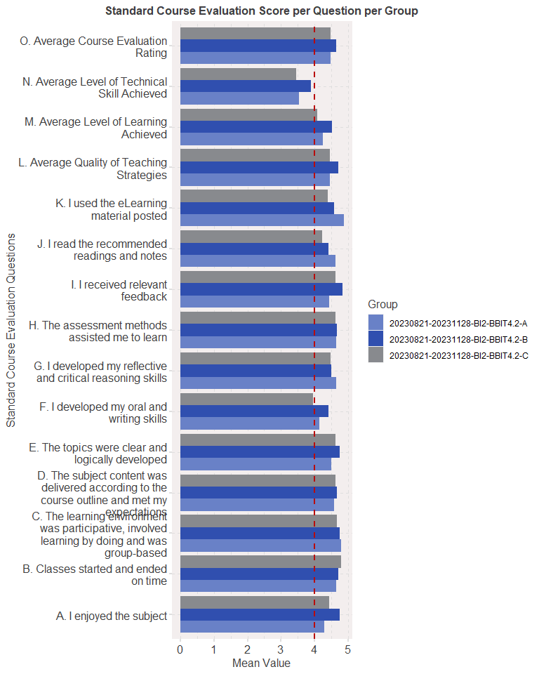<!-- -->

\newpage

The **"Average Course Evaluation Rating"** variable in the plot below indicates the score **per gender** with a baseline of 4/5.

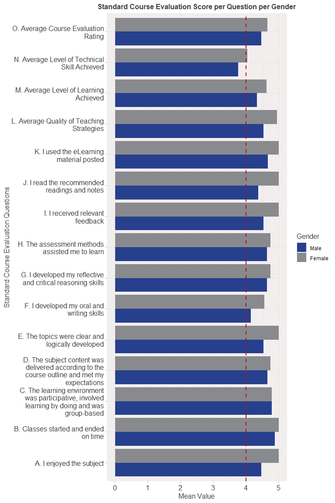<!-- -->

\newpage

The plot below presents a drill-down of the class group into **regular and exempt** students:

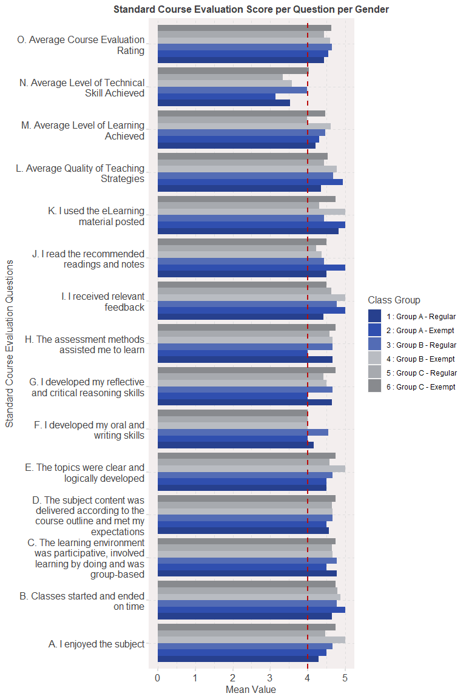<!-- -->

\newpage

Note that the 22 indicated as "NA" are all in Group A. Group A students filled in the course evaluation form before the question was set. Out of those asked, 98% do not regret the choice to take the Business Intelligence Option instead of the Computer Networking Option in their final year.

<table>
 <thead>
  <tr>
   <th style="text-align:left;"> Do you regret choosing the BI Option? </th>
   <th style="text-align:right;"> Number </th>
  </tr>
 </thead>
<tbody>
  <tr>
   <td style="text-align:left;"> 1 : Yes </td>
   <td style="text-align:right;"> 2 </td>
  </tr>
  <tr>
   <td style="text-align:left;"> 2 : No </td>
   <td style="text-align:right;"> 83 </td>
  </tr>
  <tr>
   <td style="text-align:left;"> NA </td>
   <td style="text-align:right;"> 22 </td>
  </tr>
</tbody>
</table>

\newpage

## Correlations

The specific correlation values are presented below:

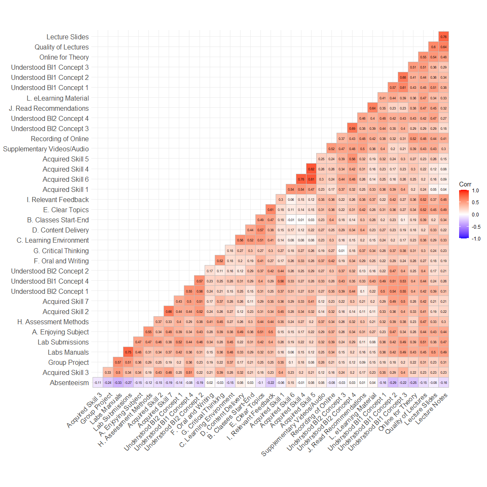<!-- -->

### Interesting Correlations

The following are hypothetical statements given that "correlation does not imply causation".

-   **.81 correlation** between "Acquired Skill 6 (ClickHouse)" and "Acquired Skill 5 (ksqlDB)": *The two technologies are related and taught in the same lab (Data Engineering).*

-   **.82 correlation** between "Acquired Skill 4 (Kafka)" and "Acquired Skill 5 (ksqlDB)": *The two technologies are related and taught in the same lab and concept (Data Engineering).*

-   **.78 correlation** between "Acquired Skill 6 (ClickHouse)" and "Acquired Skill 4 (Kafka)": *The two technologies are related and taught in the same lab (Data Engineering).*

-   **.75 correlation** between "Lab Manuals (Lab manuals that outline the steps to follow during the labs)" and "Lab Submissions (Required lab work submissions at the end of each lab manual that outline the activity to be done on your own)": *The more the effort to clearly outline the steps to be done in a lab manual, the more impact it has on the students' learning.*

-   **.76 correlation** between "The quality of lecture slides" and "the quality of lecture notes on some of the slides: *The higher the quality of the slides, the higher the quality of the notes on some of the slides.*

(1) A **.76 correlation** between "The quality of lecture slides" and "the quality of lecture notes on some of the slides.

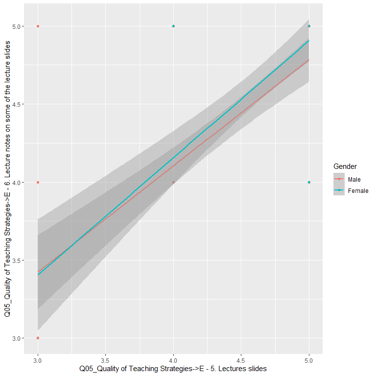<!-- -->

\newpage

(2) A **.75 correlation** between "Lab Manuals (Lab manuals that outline the steps to follow during the labs)" and "Lab Submissions (Required lab work submissions at the end of each lab manual that outline the activity to be done on your own)".

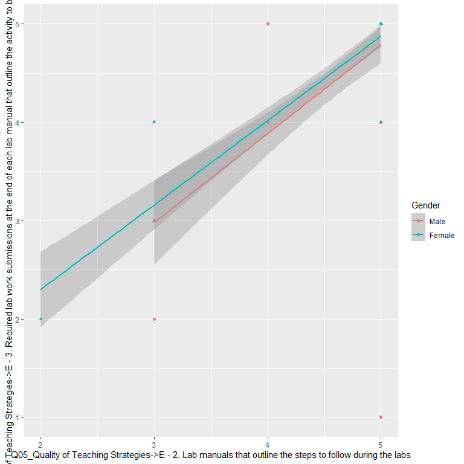<!-- -->

\newpage

### Absenteeism Percentage

The lower the absenteeism, the more a student makes use of the lab manuals for practical classes. And the more a student makes use of the lab manuals, the more the lab submissions have an impact on their overall acquisition of skills.

With this in mind, a further investigation of the **absenteeism percentage** is presented below.

#### Absenteeism by General Class Group

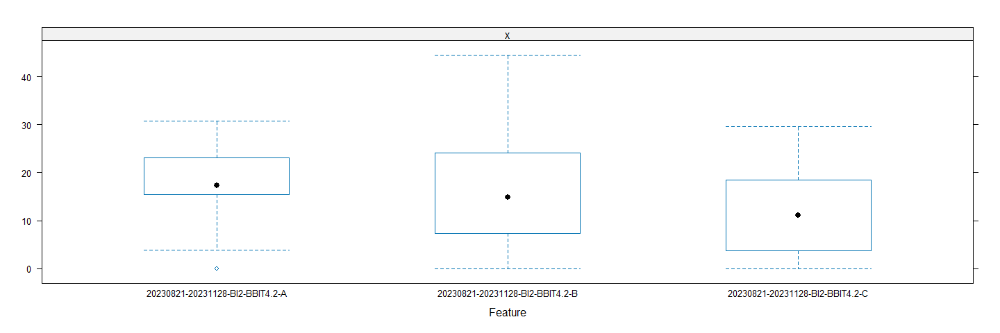<!-- -->

#### Absenteeism by Specific Class Group

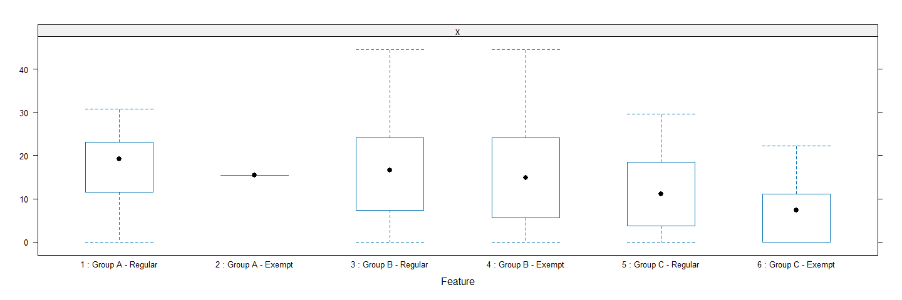<!-- -->

#### Absenteeism by Gender

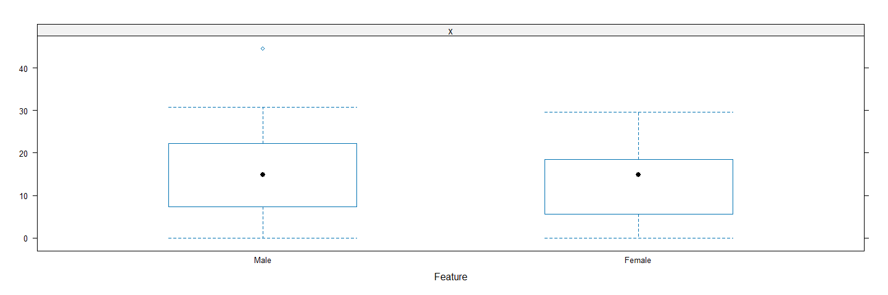<!-- -->

\newpage

# Qualitative Data Analysis

## Sentiment Analysis (Lexicon-Based)

The "likes" refer to the answer to the question, "Write two things you liked about the teaching and learning in this course." The sentiments expressed through the "likes" are:

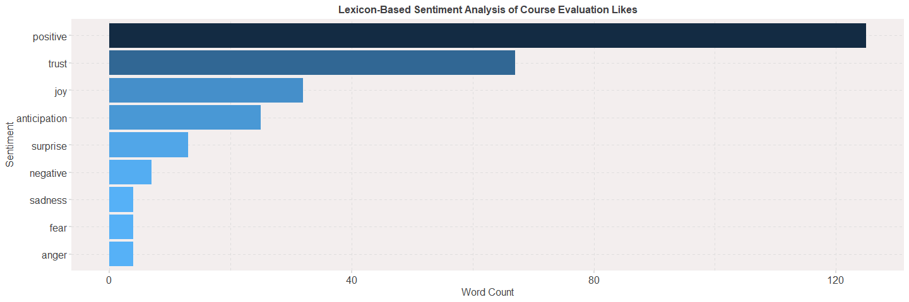<!-- -->

The "wishes" refer to the answer to the question, "Write at least one recommendation to improve the teaching and learning in this course (for future classes)". The sentiments expressed through the "wishes" are:

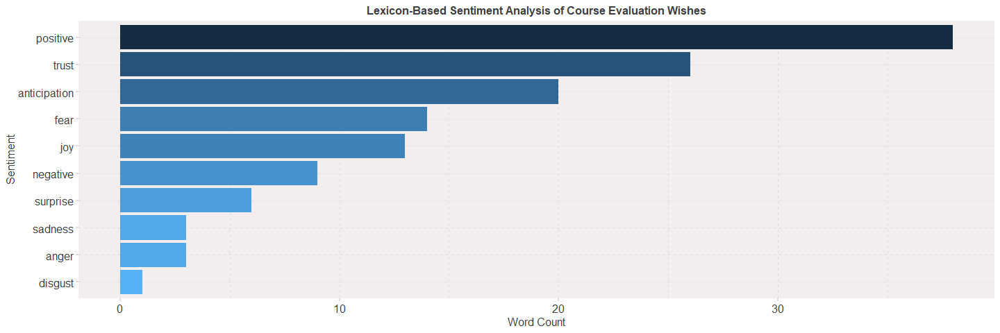<!-- -->

\newpage

Chord Diagram of Likes per Class Group:

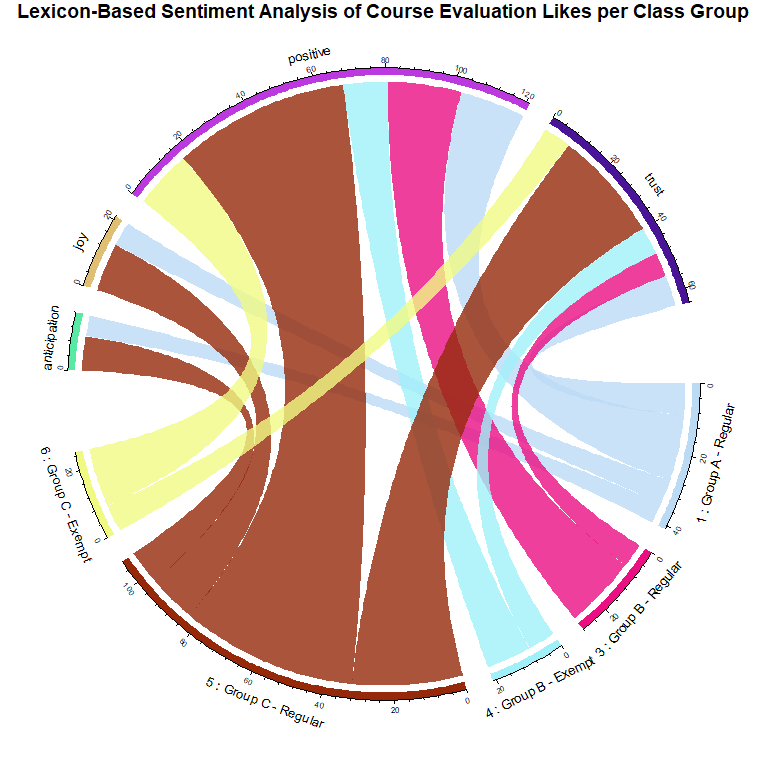<!-- -->

\newpage

Chord Diagram of Likes per Class Gender:

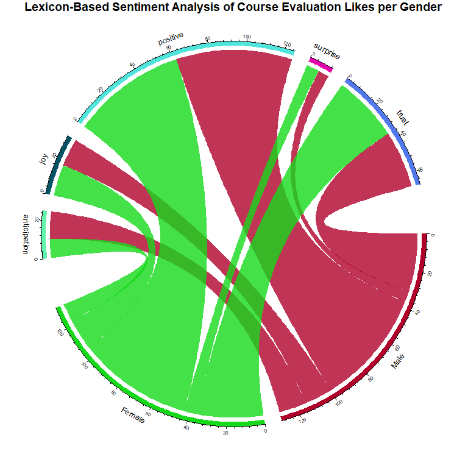<!-- -->

\newpage

Chord Diagram of Wishes per Class Group:

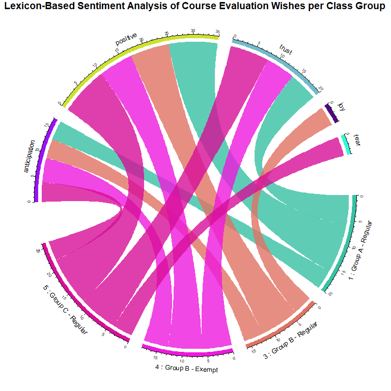<!-- -->

\newpage

Chord Diagram of Wishes per Gender:

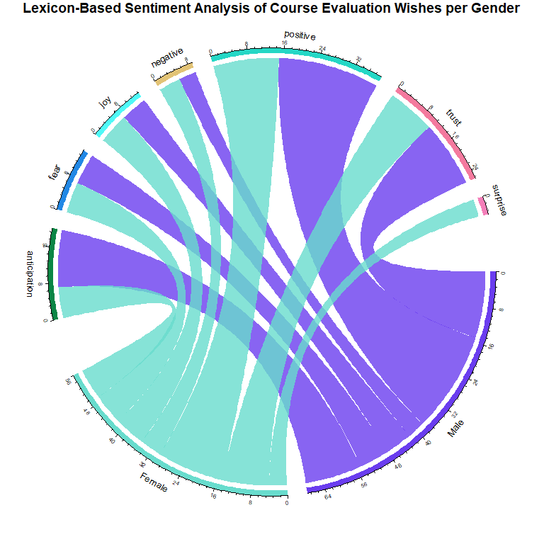<!-- -->

\newpage

## Topic Modelling (Latent Dirichlet Allocation (LDA) based)

The goal of topic modelling is to identify latent (hidden) terms (topics) in the students' course evaluation textual feedback. In this case, a topic is a mixture of words and a student's textual feedback is a combination of one or more topics (mixed-membership model).

The 2 topics for the "likes" (as guided by the LDA model) are:

1.  Topic 1: Well-Explained Lectures

2.  Topic 2: Collaborative Environment

3.  Topic 3: Well-Taught for Ease of Understanding

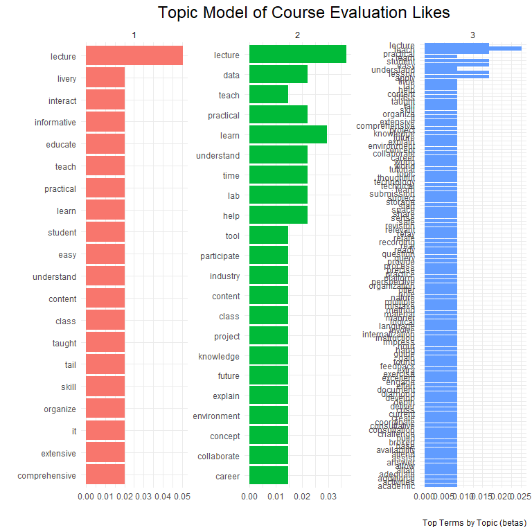<!-- -->

\newpage

The 5 topics for the "wishes" (as guided by the LDA model) are:

1.  Topic 1: Reduce the Workload

2.  Topic 2: Reduce the Complexity of the Labs

3.  Topic 3: Application of Data Engineering

4.  Topic 4: Application of Python

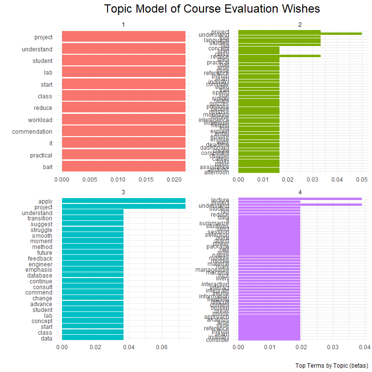<!-- -->

\newpage

The 3 topics for the recommended BI content (as guided by the LDA model) are:

1.  Topic 1: Python

2.  Topic 2: Tableau

3.  Topic 3: PowerBI

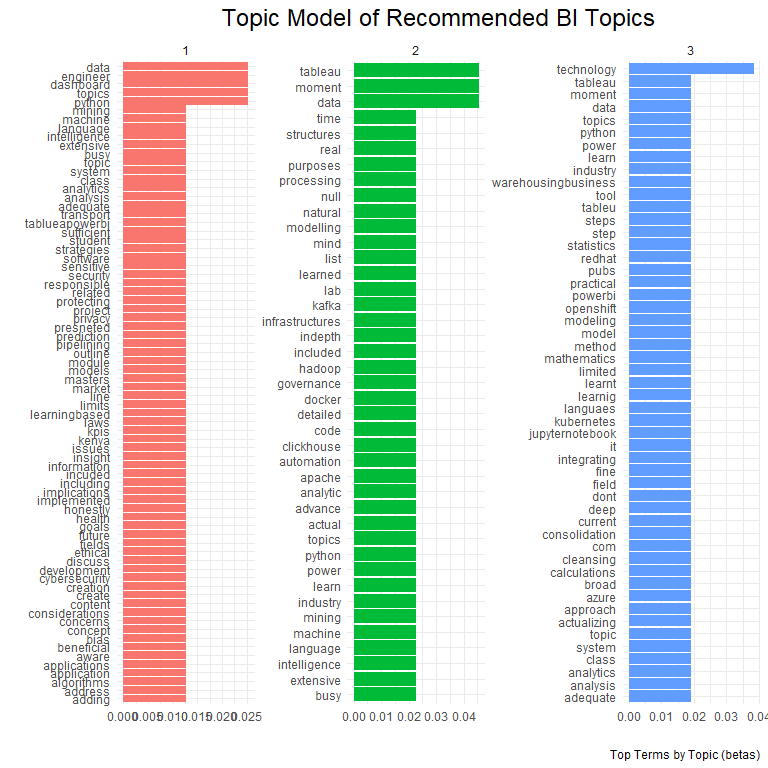<!-- -->

\newpage

# Appendices

## Appendix A: Full Name of Variables

The following variables have been renamed to fit the correlation plots:

-   \`A. Enjoying Subject\` = \`Q02_General Questions-\>A - 1. I enjoyed the subject\`,

-   \`B. Classes Start-End\` = \`Q02_General Questions-\>A - 2. Classes started and ended on time\`,

-   \`C. Learning Environment\` = \`Q02_General Questions-\>A - 3. The learning environment was participative, involved learning by doing and was group-based\`,

-   \`D. Content Delivery\` = \`Q02_General Questions-\>A - 4. The subject content was delivered according to the course outline and met my expectations\`,

-   \`E. Clear Topics\` = \`Q02_General Questions-\>A - 5. The topics were clear and logically developed\`,

-   \`F. Oral and Writing\` = \`Q02_General Questions-\>A - 6. I developed my oral and writing skills\`,

-   \`G. Critical Thinking\` = \`Q02_General Questions-\>A - 7. I developed my reflective and critical reasoning skills\`,

-   \`H. Assessment Methods\` = \`Q02_General Questions-\>A - 8. The assessment methods assisted me to learn\`,

-   \`I. Relevant Feedback\` = \`Q02_General Questions-\>A - 9. I received relevant feedback\`,

-   \`J. Read Recommendations\` = \`Q02_General Questions-\>A - 10. I read the recommended readings and notes\`,

-   \`L. eLearning Material\` = \`Q02_General Questions-\>A - 11. I used the eLearning material posted\`,

-   \`Understood BI1 Concept 1\` = \`Q03_Level of Learning Achieved-\>B - 1. - BI1 - Concept 1 of 4: Ensemble Methods for Predictive Analytics\`,

-   \`Understood BI1 Concept 2\` = \`Q03_Level of Learning Achieved-\>B - 2. - BI1 - Concept 2 of 4: Linear Algorithms for Predictive Analytics\`,

-   \`Understood BI1 Concept 3\` = \`Q03_Level of Learning Achieved-\>B - 3. - BI1 - Concept 3 of 4: Non-Linear Algorithms for Predictive Analytics\`,

-   \`Understood BI1 Concept 4\` = \`Q03_Level of Learning Achieved-\>B - 4. - BI1 - Concept 4 of 4: Dashboarding for Business-Facing and Customer-Facing Analytics\`,

-   \`Understood BI2 Concept 1\` = \`Q03_Level of Learning Achieved-\>B - 1. - BI2 - Concept 1 of 4: Ensemble Methods for Predictive Analytics\`,

-   \`Understood BI2 Concept 2\` = \`Q03_Level of Learning Achieved-\>B - 2. - BI2 - Concept 2 of 4: Predictive Modelling Using R\`,

-   \`Understood BI2 Concept 3\` = \`Q03_Level of Learning Achieved-\>B - 3. - BI2 - Concept 3 of 4: Data Warehousing and BI Strategy Implementation\`,

-   \`Understood BI2 Concept 4\` = \`Q03_Level of Learning Achieved-\>B - 4. - BI2 - Concept 4 of 4: Data Engineering\`,

-   \`Acquired Skill 1\` = \`Q04_Competency for Technologies-\>D - 1. ChartJS\`,

-   \`Acquired Skill 2\` = \`Q04_Competency for Technologies-\>D - 2. R (includes R markdown and R plumber)\`,

-   \`Acquired Skill 3\` = \`Q04_Competency for Technologies-\>D - 3. MySQL\`,

-   \`Acquired Skill 4\` = \`Q04_Competency for Technologies-\>D - 4. Kafka\`,

-   \`Acquired Skill 5\` = \`Q04_Competency for Technologies-\>D - 5. ksqlDB\`,

-   \`Acquired Skill 6\` = \`Q04_Competency for Technologies-\>D - 6. ClickHouse\`,

-   \`Acquired Skill 7\` = \`Q04_Competency for Technologies-\>D - 7. Linear and Non-Linear ML Algorithms in the caret package\`,

-   \`Group Project\` = \`Q05_Quality of Teaching Strategies-\>E - 1. Group project\`,

-   \`Labs Manuals\` = \`Q05_Quality of Teaching Strategies-\>E - 2. Lab manuals that outline the steps to follow during the labs\`,

-   \`Lab Submissions\` = \`Q05_Quality of Teaching Strategies-\>E - 3. Required lab work submissions at the end of each lab manual that outline the activity to be done on your own\`,

-   \`Supplementary Videos/Audio\` = \`Q05_Quality of Teaching Strategies-\>E - 4. Supplementary videos/audio to watch/listen to\`,

-   \`Lecture Slides\` = \`Q05_Quality of Teaching Strategies-\>E - 5. Lectures slides\`,

-   \`Lecture Notes\` = \`Q05_Quality of Teaching Strategies-\>E - 6. Lecture notes on some of the lecture slides\`,

-   \`Quality of Lectures\` = \`Q05_Quality of Teaching Strategies-\>E - 7. The quality of the lectures given (quality measured by the breadth (the full span of knowledge of a subject) and depth (the extent to which specific topics are focused upon, amplified, and explored) of learning - NOT quality measured by how fun/comical the lectures are)\`,

-   \`Online for Theory\` = \`Q05_Quality of Teaching Strategies-\>E - 8. The division of theory and practice such that most of the theory is done during the recorded online classes and most of the practice is done during the physical classes\`,

-   \`Recording of Online\` = \`Q05_Quality of Teaching Strategies-\>E - 9. The recordings of online classes\`

\newpage

## Appendix B: Raw Qualitative Data

### Likes

The raw data of the likes is as follows:

<table class="table" style="margin-left: auto; margin-right: auto;">
<caption>Write two things you like about the teaching and learning in this unit so far</caption>
 <thead>
  <tr>
   <th style="text-align:left;"> Comment (Likes) </th>
  </tr>
 </thead>
<tbody>
  <tr>
   <td style="text-align:left;width: 35em; border-bottom: 1px solid;"> Improved my knowledge on R markdown As well as Knowledge Discovery in Databases </td>
  </tr>
  <tr>
   <td style="text-align:left;width: 35em; border-bottom: 1px solid;"> It was interactive and engaging   the leacturer gave clear and easy to understand materials </td>
  </tr>
  <tr>
   <td style="text-align:left;width: 35em; border-bottom: 1px solid;"> Organized, Extensive </td>
  </tr>
  <tr>
   <td style="text-align:left;width: 35em; border-bottom: 1px solid;"> Group lab workThe lecturer's detail </td>
  </tr>
  <tr>
   <td style="text-align:left;width: 35em; border-bottom: 1px solid;"> *- It was practical and engaging  - use of github for collaboration </td>
  </tr>
  <tr>
   <td style="text-align:left;width: 35em; border-bottom: 1px solid;"> The teaching stye  The labs </td>
  </tr>
  <tr>
   <td style="text-align:left;width: 35em; border-bottom: 1px solid;"> - It was very practical   - The concepts were few hence easier internalization and practice </td>
  </tr>
  <tr>
   <td style="text-align:left;width: 35em; border-bottom: 1px solid;"> it was board and well understood, atleast by me  it can be used for my future career as a data analyst </td>
  </tr>
  <tr>
   <td style="text-align:left;width: 35em; border-bottom: 1px solid;"> *-Classes began and ended on time  - Lecturer was free with questions </td>
  </tr>
  <tr>
   <td style="text-align:left;width: 35em; border-bottom: 1px solid;"> It was so engaging and informative </td>
  </tr>
  <tr>
   <td style="text-align:left;width: 35em; border-bottom: 1px solid;"> Lecturer was Insightful </td>
  </tr>
  <tr>
   <td style="text-align:left;width: 35em; border-bottom: 1px solid;"> time management </td>
  </tr>
  <tr>
   <td style="text-align:left;width: 35em; border-bottom: 1px solid;"> The level of teaching by the lecturer  </td>
  </tr>
  <tr>
   <td style="text-align:left;width: 35em; border-bottom: 1px solid;"> 1. Comprehensive  2. Detailed </td>
  </tr>
  <tr>
   <td style="text-align:left;width: 35em; border-bottom: 1px solid;"> How extensive it was  Good delivery </td>
  </tr>
  <tr>
   <td style="text-align:left;width: 35em; border-bottom: 1px solid;"> The power point was easy to understand. </td>
  </tr>
  <tr>
   <td style="text-align:left;width: 35em; border-bottom: 1px solid;"> Comprehensive Introduction and use of GitHub and Collaborations tools as a Version Control System.   Learning R and R studio and also road towards being a Data Engineer.  </td>
  </tr>
  <tr>
   <td style="text-align:left;width: 35em; border-bottom: 1px solid;"> The organized delivery of content.    </td>
  </tr>
  <tr>
   <td style="text-align:left;width: 35em; border-bottom: 1px solid;"> The applicability The knowledge gained about the industry </td>
  </tr>
  <tr>
   <td style="text-align:left;width: 35em; border-bottom: 1px solid;"> The labs   That the practical side was taught in class </td>
  </tr>
  <tr>
   <td style="text-align:left;width: 35em; border-bottom: 1px solid;"> The lecture cares which is not most common in University. Keep caring sir it helps students learn better. </td>
  </tr>
  <tr>
   <td style="text-align:left;width: 35em; border-bottom: 1px solid;"> It was more on the practical side so it was interesting to learn in that way  Ample time was given to finish the project </td>
  </tr>
  <tr>
   <td style="text-align:left;width: 35em; border-bottom: 1px solid;"> Lab activities  Tasks given boosted learning </td>
  </tr>
  <tr>
   <td style="text-align:left;width: 35em; border-bottom: 1px solid;"> I liked that the teaching and learning was very involving in the class and was group-based.  I liked that it helped me in choosing my career path. </td>
  </tr>
  <tr>
   <td style="text-align:left;width: 35em; border-bottom: 1px solid;"> Learning about different models   The teaching assessments was done in form of groups </td>
  </tr>
  <tr>
   <td style="text-align:left;width: 35em; border-bottom: 1px solid;"> I appreciated the personalized learning approach the lecturer offered each student in case of challenges.  I appreciated the flexibility of the deadlines of the labs and projects.    </td>
  </tr>
  <tr>
   <td style="text-align:left;width: 35em; border-bottom: 1px solid;"> The unit was very practical  The labs were organized in an excellent manner that assisted in clear understanding of the R language </td>
  </tr>
  <tr>
   <td style="text-align:left;width: 35em; border-bottom: 1px solid;"> Hands on labs  use of current technologies </td>
  </tr>
  <tr>
   <td style="text-align:left;width: 35em; border-bottom: 1px solid;"> Group labs created a platform to gain different perspectives from other students  lab tutorials were detailed allowing for easy understanding of the content </td>
  </tr>
  <tr>
   <td style="text-align:left;width: 35em; border-bottom: 1px solid;"> The lecturer always provided help where possible.   The lecturer was organized making it easier to understand the unit.  The lecturer was dedicated and loved teaching. </td>
  </tr>
  <tr>
   <td style="text-align:left;width: 35em; border-bottom: 1px solid;"> *- the unit was taught very comprehensively.  - the unit was very educative in relation to real world application such as dashboarding and Data analytics. </td>
  </tr>
  <tr>
   <td style="text-align:left;width: 35em; border-bottom: 1px solid;"> The in depth of the content and the practical labs  </td>
  </tr>
  <tr>
   <td style="text-align:left;width: 35em; border-bottom: 1px solid;"> The content  The Teaching style </td>
  </tr>
  <tr>
   <td style="text-align:left;width: 35em; border-bottom: 1px solid;"> The lecturer found a way to have recordings available to us despite the challenges on storage, and set aside consultation hours for one to  go conslult. He made the learning environment  safe sapce to make mistkes and say wrng answer and give one's thoughts </td>
  </tr>
  <tr>
   <td style="text-align:left;width: 35em; border-bottom: 1px solid;"> Classes were engaging  Detailed lab instructions </td>
  </tr>
  <tr>
   <td style="text-align:left;width: 35em; border-bottom: 1px solid;"> good  explanation </td>
  </tr>
  <tr>
   <td style="text-align:left;width: 35em; border-bottom: 1px solid;"> involvment with the students </td>
  </tr>
  <tr>
   <td style="text-align:left;width: 35em; border-bottom: 1px solid;"> mode of delivery  practicals but not that much </td>
  </tr>
  <tr>
   <td style="text-align:left;width: 35em; border-bottom: 1px solid;"> The mode of delivery  The way the topics were logically developed </td>
  </tr>
  <tr>
   <td style="text-align:left;width: 35em; border-bottom: 1px solid;"> The student - teacher relation in regards to academics  The avaliabillity of multiple content </td>
  </tr>
  <tr>
   <td style="text-align:left;width: 35em; border-bottom: 1px solid;"> Group work </td>
  </tr>
  <tr>
   <td style="text-align:left;width: 35em; border-bottom: 1px solid;"> The notes were provided before the classes  The lecturer took time to teach which helped in understanding the concepts </td>
  </tr>
  <tr>
   <td style="text-align:left;width: 35em; border-bottom: 1px solid;"> The lecturer is well endowed with the concepts and this made it easy to understand.  The labs allowed me to think outside the box and this was nice. </td>
  </tr>
  <tr>
   <td style="text-align:left;width: 35em; border-bottom: 1px solid;"> The detailed information given when learning the labs   The participative environment </td>
  </tr>
  <tr>
   <td style="text-align:left;width: 35em; border-bottom: 1px solid;"> doing the labs  quizzes after each topic </td>
  </tr>
  <tr>
   <td style="text-align:left;width: 35em; border-bottom: 1px solid;"> The labs were informative  The lectures were thorough  </td>
  </tr>
  <tr>
   <td style="text-align:left;width: 35em; border-bottom: 1px solid;"> The interactiveness </td>
  </tr>
  <tr>
   <td style="text-align:left;width: 35em; border-bottom: 1px solid;"> The lecturer explains the concepts well  The classes are very interesting </td>
  </tr>
  <tr>
   <td style="text-align:left;width: 35em; border-bottom: 1px solid;"> The unit did have a lot of content but the content was also very educative and enabled me to know about BI.  The lecturer taught the unit well and all the information put across well. </td>
  </tr>
  <tr>
   <td style="text-align:left;width: 35em; border-bottom: 1px solid;"> Very Organised </td>
  </tr>
  <tr>
   <td style="text-align:left;width: 35em; border-bottom: 1px solid;"> ... </td>
  </tr>
  <tr>
   <td style="text-align:left;width: 35em; border-bottom: 1px solid;"> Labs and projects  Material shared helped me learn </td>
  </tr>
  <tr>
   <td style="text-align:left;width: 35em; border-bottom: 1px solid;"> Intelligence </td>
  </tr>
  <tr>
   <td style="text-align:left;width: 35em; border-bottom: 1px solid;"> Class engagement </td>
  </tr>
  <tr>
   <td style="text-align:left;width: 35em; border-bottom: 1px solid;"> Well explained topics.  GitHub relation to the labs done. </td>
  </tr>
  <tr>
   <td style="text-align:left;width: 35em; border-bottom: 1px solid;"> clear showing of the practical conceptsclearly showed hoe to use GitHub for teams </td>
  </tr>
  <tr>
   <td style="text-align:left;width: 35em; border-bottom: 1px solid;"> 1. The group work  2. The labs and even the explanation and teaching of the labs was well done </td>
  </tr>
  <tr>
   <td style="text-align:left;width: 35em; border-bottom: 1px solid;"> The depth of knowledge and content shared is really impressive. </td>
  </tr>
  <tr>
   <td style="text-align:left;width: 35em; border-bottom: 1px solid;"> N/A </td>
  </tr>
  <tr>
   <td style="text-align:left;width: 35em; border-bottom: 1px solid;"> The KDD process and the practical learning </td>
  </tr>
  <tr>
   <td style="text-align:left;width: 35em; border-bottom: 1px solid;"> Practise materials and lessons </td>
  </tr>
  <tr>
   <td style="text-align:left;width: 35em; border-bottom: 1px solid;"> Learning R langauge and how we can play with data  </td>
  </tr>
  <tr>
   <td style="text-align:left;width: 35em; border-bottom: 1px solid;"> I learnt Rand how data analytics is all about </td>
  </tr>
  <tr>
   <td style="text-align:left;width: 35em; border-bottom: 1px solid;"> Group assignment via the github  </td>
  </tr>
  <tr>
   <td style="text-align:left;width: 35em; border-bottom: 1px solid;"> the interactive lab works and the quizes </td>
  </tr>
  <tr>
   <td style="text-align:left;width: 35em; border-bottom: 1px solid;"> The learning environment was participative  The lecturer explained the concepts well    </td>
  </tr>
  <tr>
   <td style="text-align:left;width: 35em; border-bottom: 1px solid;"> Every concept taught was explained extensive and tested   The Lab work were really good which I was able to gather knowledge and skills that I can use in my future or even to expand the knowledge in that field    </td>
  </tr>
  <tr>
   <td style="text-align:left;width: 35em; border-bottom: 1px solid;"> technical hands on labs  improved knowledge on data analysis </td>
  </tr>
  <tr>
   <td style="text-align:left;width: 35em; border-bottom: 1px solid;"> The practical labs on GitHub made me competent on how to use such tools.  Learning how to use R something that can be added on my CV. </td>
  </tr>
  <tr>
   <td style="text-align:left;width: 35em; border-bottom: 1px solid;"> The practical side of learning using the labs  The projects help me learn a lot </td>
  </tr>
  <tr>
   <td style="text-align:left;width: 35em; border-bottom: 1px solid;"> the labs were developed very thoughtfully to build technical and collaborative skills   the concepts were thoroughly explained especially in the labs with relavant real world applications  </td>
  </tr>
  <tr>
   <td style="text-align:left;width: 35em; border-bottom: 1px solid;"> Thorough content  Practicality  </td>
  </tr>
  <tr>
   <td style="text-align:left;width: 35em; border-bottom: 1px solid;"> the lab work submission instructions on the document  coordination in github </td>
  </tr>
  <tr>
   <td style="text-align:left;width: 35em; border-bottom: 1px solid;"> understanding and helpful </td>
  </tr>
  <tr>
   <td style="text-align:left;width: 35em; border-bottom: 1px solid;"> The unit was delivered well.  The practical side of the unit was well explained </td>
  </tr>
  <tr>
   <td style="text-align:left;width: 35em; border-bottom: 1px solid;"> The lecturer is keen to make sure no student is left behind.  The learning is very practical thus allowing students to learn for themselves. </td>
  </tr>
  <tr>
   <td style="text-align:left;width: 35em; border-bottom: 1px solid;"> lecture slides  group projects </td>
  </tr>
  <tr>
   <td style="text-align:left;width: 35em; border-bottom: 1px solid;"> Interactive </td>
  </tr>
  <tr>
   <td style="text-align:left;width: 35em; border-bottom: 1px solid;"> the lecturers panctuality.  the mode of teaching </td>
  </tr>
  <tr>
   <td style="text-align:left;width: 35em; border-bottom: 1px solid;"> Composure of lecturer, His need for us to learn processes that are applicable to the job market, e.g. Github </td>
  </tr>
  <tr>
   <td style="text-align:left;width: 35em; border-bottom: 1px solid;"> I liked that the lecturer was so clear and precise in the content he gave us, it was adequate and you could tell that it made sense   I liked that he went out of his way to teach us extra concepts that will help us in our carreer, that was very thoughtful of him. </td>
  </tr>
  <tr>
   <td style="text-align:left;width: 35em; border-bottom: 1px solid;"> Topics were well explained </td>
  </tr>
  <tr>
   <td style="text-align:left;width: 35em; border-bottom: 1px solid;"> 1. The lectures started and ended in time, leaving room to ask the lecturer for further assistance if one is stuck.  2. The Lecturer responded to emails in a very convenient and timely manner. </td>
  </tr>
  <tr>
   <td style="text-align:left;width: 35em; border-bottom: 1px solid;"> Model DesignR-programing </td>
  </tr>
  <tr>
   <td style="text-align:left;width: 35em; border-bottom: 1px solid;"> Lab work and lectures </td>
  </tr>
  <tr>
   <td style="text-align:left;width: 35em; border-bottom: 1px solid;"> Lab Exercises </td>
  </tr>
  <tr>
   <td style="text-align:left;width: 35em; border-bottom: 1px solid;"> I liked doing the labs and quizzes </td>
  </tr>
  <tr>
   <td style="text-align:left;width: 35em; border-bottom: 1px solid;"> The practicals offered in class during the lessonsN/A  </td>
  </tr>
  <tr>
   <td style="text-align:left;width: 35em; border-bottom: 1px solid;"> *-the practicals  -the detailed notes </td>
  </tr>
  <tr>
   <td style="text-align:left;width: 35em; border-bottom: 1px solid;"> I liked the learning in general, very interesting topics were discussed </td>
  </tr>
  <tr>
   <td style="text-align:left;width: 35em; border-bottom: 1px solid;"> I liked how each of the topics and labs were broken down </td>
  </tr>
  <tr>
   <td style="text-align:left;width: 35em; border-bottom: 1px solid;"> Good lecturer  </td>
  </tr>
  <tr>
   <td style="text-align:left;width: 35em; border-bottom: 1px solid;"> The group work interaction.  Learning new skills.  The lecturer is so skilled.Bravo! </td>
  </tr>
  <tr>
   <td style="text-align:left;width: 35em; border-bottom: 1px solid;"> -I liked the fact that we learned R  </td>
  </tr>
  <tr>
   <td style="text-align:left;width: 35em; border-bottom: 1px solid;"> very organised.  reflects how the industry works especially BI 2 </td>
  </tr>
  <tr>
   <td style="text-align:left;width: 35em; border-bottom: 1px solid;"> The depth of the labs from start to end  The unit project that helped to apply all the knowledge </td>
  </tr>
  <tr>
   <td style="text-align:left;width: 35em; border-bottom: 1px solid;"> The topics were extensively taught </td>
  </tr>
  <tr>
   <td style="text-align:left;width: 35em; border-bottom: 1px solid;"> The method used to deliver content was highly inclusive </td>
  </tr>
  <tr>
   <td style="text-align:left;width: 35em; border-bottom: 1px solid;"> How the labs guided us to learning R  The labs also taught us to use Github </td>
  </tr>
  <tr>
   <td style="text-align:left;width: 35em; border-bottom: 1px solid;"> Very organized and ready to help  </td>
  </tr>
  <tr>
   <td style="text-align:left;width: 35em; border-bottom: 1px solid;"> The group projects made me understand the content better. </td>
  </tr>
  <tr>
   <td style="text-align:left;width: 35em; border-bottom: 1px solid;"> very comprehensive  </td>
  </tr>
  <tr>
   <td style="text-align:left;width: 35em; border-bottom: 1px solid;"> the group-based activities </td>
  </tr>
  <tr>
   <td style="text-align:left;width: 35em; border-bottom: 1px solid;"> Very practical subject that can be used in the future  The organization of the lecturers teaching materials </td>
  </tr>
  <tr>
   <td style="text-align:left;width: 35em; border-bottom: 1px solid;"> The lecturer attended to all our queries and questions  The lecturer gave us additional materials for revision </td>
  </tr>
  <tr>
   <td style="text-align:left;width: 35em; border-bottom: 1px solid;"> 1. relevant feedback  2. content was well and logically explained </td>
  </tr>
  <tr>
   <td style="text-align:left;width: 35em; border-bottom: 1px solid;"> The practical nature.  The teaching method and effort relayed by the lecturer, Dr. Allan Omondi. </td>
  </tr>
</tbody>
</table>

\newpage

### Wishes

The raw data of the wishes is as follows:

<table class="table" style="margin-left: auto; margin-right: auto;">
<caption>Write at least one recommendation to improve the teaching and learning in this unit (for the remaining weeks in the semester)</caption>
 <thead>
  <tr>
   <th style="text-align:left;"> Comment (Wishes) </th>
  </tr>
 </thead>
<tbody>
  <tr>
   <td style="text-align:left;width: 35em; border-bottom: 1px solid;"> None </td>
  </tr>
  <tr>
   <td style="text-align:left;width: 35em; border-bottom: 1px solid;"> Alittle more tutorials before starting a different topic or project would help adversly to get familiar with it </td>
  </tr>
  <tr>
   <td style="text-align:left;width: 35em; border-bottom: 1px solid;"> Flexibility, </td>
  </tr>
  <tr>
   <td style="text-align:left;width: 35em; border-bottom: 1px solid;"> The group project has to be better integrated with the BI project so as to mean that BI doesn't have to be srtictly seen through one lense as was the case in this lecture </td>
  </tr>
  <tr>
   <td style="text-align:left;width: 35em; border-bottom: 1px solid;"> use of various data analytics tools </td>
  </tr>
  <tr>
   <td style="text-align:left;width: 35em; border-bottom: 1px solid;"> Classes are ok as they are  </td>
  </tr>
  <tr>
   <td style="text-align:left;width: 35em; border-bottom: 1px solid;"> *- Sync the project and labs for easier implementation of concepts as was done in advanced database systems </td>
  </tr>
  <tr>
   <td style="text-align:left;width: 35em; border-bottom: 1px solid;"> i dont have any </td>
  </tr>
  <tr>
   <td style="text-align:left;width: 35em; border-bottom: 1px solid;"> *-None </td>
  </tr>
  <tr>
   <td style="text-align:left;width: 35em; border-bottom: 1px solid;"> Provision of student packages to software that run on subscription. </td>
  </tr>
  <tr>
   <td style="text-align:left;width: 35em; border-bottom: 1px solid;"> Maybe the lecturer can be more intreractive </td>
  </tr>
  <tr>
   <td style="text-align:left;width: 35em; border-bottom: 1px solid;"> collaborative learning in class  </td>
  </tr>
  <tr>
   <td style="text-align:left;width: 35em; border-bottom: 1px solid;"> N/A </td>
  </tr>
  <tr>
   <td style="text-align:left;width: 35em; border-bottom: 1px solid;"> Longer deadlines. </td>
  </tr>
  <tr>
   <td style="text-align:left;width: 35em; border-bottom: 1px solid;"> Reduce the workload just abit, and improve how course work marks are divided </td>
  </tr>
  <tr>
   <td style="text-align:left;width: 35em; border-bottom: 1px solid;"> Please please, make the labs understandable there was too much information I could not understand anything. </td>
  </tr>
  <tr>
   <td style="text-align:left;width: 35em; border-bottom: 1px solid;"> At the moment everything is okay  </td>
  </tr>
  <tr>
   <td style="text-align:left;width: 35em; border-bottom: 1px solid;"> N/A </td>
  </tr>
  <tr>
   <td style="text-align:left;width: 35em; border-bottom: 1px solid;"> A bit more assistance in regards to the BI project </td>
  </tr>
  <tr>
   <td style="text-align:left;width: 35em; border-bottom: 1px solid;"> Less group work </td>
  </tr>
  <tr>
   <td style="text-align:left;width: 35em; border-bottom: 1px solid;"> I would suggest doing the project throughout the course like it was done in Advanced Database where each lab applies to a students project so on and so forth which may help students understand better as they apply it to their projects.  </td>
  </tr>
  <tr>
   <td style="text-align:left;width: 35em; border-bottom: 1px solid;"> Feedback </td>
  </tr>
  <tr>
   <td style="text-align:left;width: 35em; border-bottom: 1px solid;"> More lab sessions  Interaction with the industry </td>
  </tr>
  <tr>
   <td style="text-align:left;width: 35em; border-bottom: 1px solid;"> I would recommend for the same methods used to continue for future classes. </td>
  </tr>
  <tr>
   <td style="text-align:left;width: 35em; border-bottom: 1px solid;"> Be able to consult students and know what they are struggling with in order to help them understand the course a lot more </td>
  </tr>
  <tr>
   <td style="text-align:left;width: 35em; border-bottom: 1px solid;"> N/A </td>
  </tr>
  <tr>
   <td style="text-align:left;width: 35em; border-bottom: 1px solid;"> I would recommend the unit to be done in a 'LAB' </td>
  </tr>
  <tr>
   <td style="text-align:left;width: 35em; border-bottom: 1px solid;"> n/a </td>
  </tr>
  <tr>
   <td style="text-align:left;width: 35em; border-bottom: 1px solid;"> For a distinction between labs and theory in order to well understand the computations  </td>
  </tr>
  <tr>
   <td style="text-align:left;width: 35em; border-bottom: 1px solid;"> The BI unit to be  taught early from maybe third year since it is a specialization unit. This will help with understanding the unit better since it is bulky and getting more industrial knowledge like understanding kafka and more.  The BI project especially the coding, to start early so that we get more time to do the project well. </td>
  </tr>
  <tr>
   <td style="text-align:left;width: 35em; border-bottom: 1px solid;"> *- more reference materials. </td>
  </tr>
  <tr>
   <td style="text-align:left;width: 35em; border-bottom: 1px solid;"> For labs, earlier classes in the day as opposed to afternoon classes  </td>
  </tr>
  <tr>
   <td style="text-align:left;width: 35em; border-bottom: 1px solid;"> None </td>
  </tr>
  <tr>
   <td style="text-align:left;width: 35em; border-bottom: 1px solid;"> No comment </td>
  </tr>
  <tr>
   <td style="text-align:left;width: 35em; border-bottom: 1px solid;"> N/A </td>
  </tr>
  <tr>
   <td style="text-align:left;width: 35em; border-bottom: 1px solid;"> n/a </td>
  </tr>
  <tr>
   <td style="text-align:left;width: 35em; border-bottom: 1px solid;"> none </td>
  </tr>
  <tr>
   <td style="text-align:left;width: 35em; border-bottom: 1px solid;"> Content is too much. Reduce the content and nature of the labs </td>
  </tr>
  <tr>
   <td style="text-align:left;width: 35em; border-bottom: 1px solid;"> Good Luck </td>
  </tr>
  <tr>
   <td style="text-align:left;width: 35em; border-bottom: 1px solid;"> Make up Cats </td>
  </tr>
  <tr>
   <td style="text-align:left;width: 35em; border-bottom: 1px solid;"> None </td>
  </tr>
  <tr>
   <td style="text-align:left;width: 35em; border-bottom: 1px solid;"> No more recommendations </td>
  </tr>
  <tr>
   <td style="text-align:left;width: 35em; border-bottom: 1px solid;"> Nothing should change. </td>
  </tr>
  <tr>
   <td style="text-align:left;width: 35em; border-bottom: 1px solid;"> More empasis on the data engineering concept </td>
  </tr>
  <tr>
   <td style="text-align:left;width: 35em; border-bottom: 1px solid;"> add bonus marks </td>
  </tr>
  <tr>
   <td style="text-align:left;width: 35em; border-bottom: 1px solid;"> The labs should keep on being done in groups </td>
  </tr>
  <tr>
   <td style="text-align:left;width: 35em; border-bottom: 1px solid;"> The software we use are unrealistic  in way they can't run on my machine,if there were provision of machine or the labs it would be good </td>
  </tr>
  <tr>
   <td style="text-align:left;width: 35em; border-bottom: 1px solid;"> Business Intelligence to be more practical </td>
  </tr>
  <tr>
   <td style="text-align:left;width: 35em; border-bottom: 1px solid;"> Maybe learning more about coding in R </td>
  </tr>
  <tr>
   <td style="text-align:left;width: 35em; border-bottom: 1px solid;"> it is good as is </td>
  </tr>
  <tr>
   <td style="text-align:left;width: 35em; border-bottom: 1px solid;"> ... </td>
  </tr>
  <tr>
   <td style="text-align:left;width: 35em; border-bottom: 1px solid;"> Since we only start working with R in BI 2. Students can start learning R during BI 1. This will help them have a good understanding of the basics of R, such that in BI 2 they will understand better the labs and be able to do the labs and projects well. They'll also be competent in R, which will be helpful in their careers industry </td>
  </tr>
  <tr>
   <td style="text-align:left;width: 35em; border-bottom: 1px solid;"> . </td>
  </tr>
  <tr>
   <td style="text-align:left;width: 35em; border-bottom: 1px solid;"> Student involvement </td>
  </tr>
  <tr>
   <td style="text-align:left;width: 35em; border-bottom: 1px solid;"> More group work </td>
  </tr>
  <tr>
   <td style="text-align:left;width: 35em; border-bottom: 1px solid;"> I have no recommendations </td>
  </tr>
  <tr>
   <td style="text-align:left;width: 35em; border-bottom: 1px solid;"> 1. Selections to be early  </td>
  </tr>
  <tr>
   <td style="text-align:left;width: 35em; border-bottom: 1px solid;"> Concept 2 of 4(BI2)went astray from my expectations of the unit. It was very informative but it was too long and there was a lot of content to work through. Probably for future groups, it can be done away with or the content condensed. Also using Python would be better than using R. </td>
  </tr>
  <tr>
   <td style="text-align:left;width: 35em; border-bottom: 1px solid;"> N/A </td>
  </tr>
  <tr>
   <td style="text-align:left;width: 35em; border-bottom: 1px solid;"> Reduce the workload. Final year students have so much work and the BI lecturer didn't seem to adjust his relative to his students </td>
  </tr>
  <tr>
   <td style="text-align:left;width: 35em; border-bottom: 1px solid;"> More feedback on the assignments given </td>
  </tr>
  <tr>
   <td style="text-align:left;width: 35em; border-bottom: 1px solid;"> N/A </td>
  </tr>
  <tr>
   <td style="text-align:left;width: 35em; border-bottom: 1px solid;"> A video that will simply entail all that will be done in Business Intelligence - like a trailer. </td>
  </tr>
  <tr>
   <td style="text-align:left;width: 35em; border-bottom: 1px solid;"> The notes inside the labs(RStudio) to be summarized in powerpoint </td>
  </tr>
  <tr>
   <td style="text-align:left;width: 35em; border-bottom: 1px solid;"> N/A </td>
  </tr>
  <tr>
   <td style="text-align:left;width: 35em; border-bottom: 1px solid;"> the slides to be well explained </td>
  </tr>
  <tr>
   <td style="text-align:left;width: 35em; border-bottom: 1px solid;"> Nothing at the moment </td>
  </tr>
  <tr>
   <td style="text-align:left;width: 35em; border-bottom: 1px solid;"> N/A </td>
  </tr>
  <tr>
   <td style="text-align:left;width: 35em; border-bottom: 1px solid;"> The time used in explaining the first previous chapters can be reduced to endure that student does not get that monotony of what has already been done.  Use of other languages as Python but R can be used as the reference tool and language. </td>
  </tr>
  <tr>
   <td style="text-align:left;width: 35em; border-bottom: 1px solid;"> Machine learning with python and learning python data analysis packages </td>
  </tr>
  <tr>
   <td style="text-align:left;width: 35em; border-bottom: 1px solid;"> that the project be different from the IS project, doing both project concurrently is confusing </td>
  </tr>
  <tr>
   <td style="text-align:left;width: 35em; border-bottom: 1px solid;"> None </td>
  </tr>
  <tr>
   <td style="text-align:left;width: 35em; border-bottom: 1px solid;"> None at the moment </td>
  </tr>
  <tr>
   <td style="text-align:left;width: 35em; border-bottom: 1px solid;"> n/a </td>
  </tr>
  <tr>
   <td style="text-align:left;width: 35em; border-bottom: 1px solid;"> For practicals adopt using new technologies that are being used in the job market. </td>
  </tr>
  <tr>
   <td style="text-align:left;width: 35em; border-bottom: 1px solid;"> The project and labs are too many and require a lot of work in very little time which is difficult with what students already have going on with other units I request the lecturer considers making them more manageable. </td>
  </tr>
  <tr>
   <td style="text-align:left;width: 35em; border-bottom: 1px solid;"> Reduce the size of the project because some people might not be doing an IS project relating to BI </td>
  </tr>
  <tr>
   <td style="text-align:left;width: 35em; border-bottom: 1px solid;"> I think it is ok </td>
  </tr>
  <tr>
   <td style="text-align:left;width: 35em; border-bottom: 1px solid;"> put a break in the middle of the lecture not towards the end of it </td>
  </tr>
  <tr>
   <td style="text-align:left;width: 35em; border-bottom: 1px solid;"> Have all the labs be individual, ensures that everyone actually understands the concepts.  </td>
  </tr>
  <tr>
   <td style="text-align:left;width: 35em; border-bottom: 1px solid;"> The class was impactful by teaching us using R however a ix of R and python would have really gone a long way. </td>
  </tr>
  <tr>
   <td style="text-align:left;width: 35em; border-bottom: 1px solid;"> The labs were good maybe reduce them a abit  How to create the dashboards practically  Quizes to be done at the end of each concept like BI 1 </td>
  </tr>
  <tr>
   <td style="text-align:left;width: 35em; border-bottom: 1px solid;"> 1. Deadlines for the labs should be considered. </td>
  </tr>
  <tr>
   <td style="text-align:left;width: 35em; border-bottom: 1px solid;"> Null </td>
  </tr>
  <tr>
   <td style="text-align:left;width: 35em; border-bottom: 1px solid;"> n/a </td>
  </tr>
  <tr>
   <td style="text-align:left;width: 35em; border-bottom: 1px solid;"> None </td>
  </tr>
  <tr>
   <td style="text-align:left;width: 35em; border-bottom: 1px solid;"> The slides could be a broken down a bit more so that not all the content is in one set </td>
  </tr>
  <tr>
   <td style="text-align:left;width: 35em; border-bottom: 1px solid;"> The project to begin at the start of the semester not close to the end </td>
  </tr>
  <tr>
   <td style="text-align:left;width: 35em; border-bottom: 1px solid;"> No reccomendation </td>
  </tr>
  <tr>
   <td style="text-align:left;width: 35em; border-bottom: 1px solid;"> Reduce the workload </td>
  </tr>
  <tr>
   <td style="text-align:left;width: 35em; border-bottom: 1px solid;"> none </td>
  </tr>
  <tr>
   <td style="text-align:left;width: 35em; border-bottom: 1px solid;"> None </td>
  </tr>
  <tr>
   <td style="text-align:left;width: 35em; border-bottom: 1px solid;"> None. </td>
  </tr>
  <tr>
   <td style="text-align:left;width: 35em; border-bottom: 1px solid;"> *Spend more times on labs </td>
  </tr>
  <tr>
   <td style="text-align:left;width: 35em; border-bottom: 1px solid;"> if we can start some labs in BI 1 for a smooth transtion in BI2 </td>
  </tr>
  <tr>
   <td style="text-align:left;width: 35em; border-bottom: 1px solid;"> Github group labs were abit confusing to work with </td>
  </tr>
  <tr>
   <td style="text-align:left;width: 35em; border-bottom: 1px solid;"> N/A </td>
  </tr>
  <tr>
   <td style="text-align:left;width: 35em; border-bottom: 1px solid;"> Different approaches towards delivery of som of the modules </td>
  </tr>
  <tr>
   <td style="text-align:left;width: 35em; border-bottom: 1px solid;"> N/A </td>
  </tr>
  <tr>
   <td style="text-align:left;width: 35em; border-bottom: 1px solid;"> Everything is in order </td>
  </tr>
  <tr>
   <td style="text-align:left;width: 35em; border-bottom: 1px solid;"> . </td>
  </tr>
  <tr>
   <td style="text-align:left;width: 35em; border-bottom: 1px solid;"> Using Python  </td>
  </tr>
  <tr>
   <td style="text-align:left;width: 35em; border-bottom: 1px solid;"> there should not be a lot of work  lecturer should be abit linient </td>
  </tr>
  <tr>
   <td style="text-align:left;width: 35em; border-bottom: 1px solid;"> N/A </td>
  </tr>
  <tr>
   <td style="text-align:left;width: 35em; border-bottom: 1px solid;"> To include Python </td>
  </tr>
  <tr>
   <td style="text-align:left;width: 35em; border-bottom: 1px solid;"> i have none </td>
  </tr>
  <tr>
   <td style="text-align:left;width: 35em; border-bottom: 1px solid;"> Reduce the content depth slightly. </td>
  </tr>
</tbody>
</table>

\newpage

## Appendix C: Additional Topics to Include in the Course

The raw data of the addtional topics to include is as follows:

<table class="table" style="margin-left: auto; margin-right: auto;">
<caption>Are there any topics that you recommend should be added to in addition to the ones already in the BI1 and BI2 course outlines?</caption>
 <thead>
  <tr>
   <th style="text-align:left;"> List of Topics </th>
  </tr>
 </thead>
<tbody>
  <tr>
   <td style="text-align:left;width: 35em; border-bottom: 1px solid;"> None </td>
  </tr>
  <tr>
   <td style="text-align:left;width: 35em; border-bottom: 1px solid;"> I would like to have learned about real time business intelligence for real time data processing and maybe some advanced data modelling </td>
  </tr>
  <tr>
   <td style="text-align:left;width: 35em; border-bottom: 1px solid;"> N/A </td>
  </tr>
  <tr>
   <td style="text-align:left;width: 35em; border-bottom: 1px solid;"> None </td>
  </tr>
  <tr>
   <td style="text-align:left;width: 35em; border-bottom: 1px solid;"> use of python language  use of tabluea/powerbi </td>
  </tr>
  <tr>
   <td style="text-align:left;width: 35em; border-bottom: 1px solid;"> N/A </td>
  </tr>
  <tr>
   <td style="text-align:left;width: 35em; border-bottom: 1px solid;"> None </td>
  </tr>
  <tr>
   <td style="text-align:left;width: 35em; border-bottom: 1px solid;"> none that i know of </td>
  </tr>
  <tr>
   <td style="text-align:left;width: 35em; border-bottom: 1px solid;"> - I honestly believe the content is sufficient even for a masters student    </td>
  </tr>
  <tr>
   <td style="text-align:left;width: 35em; border-bottom: 1px solid;"> Natural Language processing </td>
  </tr>
  <tr>
   <td style="text-align:left;width: 35em; border-bottom: 1px solid;"> N/A  </td>
  </tr>
  <tr>
   <td style="text-align:left;width: 35em; border-bottom: 1px solid;"> Real time analytic  </td>
  </tr>
  <tr>
   <td style="text-align:left;width: 35em; border-bottom: 1px solid;"> Data Pipelining  </td>
  </tr>
  <tr>
   <td style="text-align:left;width: 35em; border-bottom: 1px solid;"> None that I can think of at the moment </td>
  </tr>
  <tr>
   <td style="text-align:left;width: 35em; border-bottom: 1px solid;"> Real time BI </td>
  </tr>
  <tr>
   <td style="text-align:left;width: 35em; border-bottom: 1px solid;"> Maybe Kafka in-depth </td>
  </tr>
  <tr>
   <td style="text-align:left;width: 35em; border-bottom: 1px solid;"> Nothing much to add.  </td>
  </tr>
  <tr>
   <td style="text-align:left;width: 35em; border-bottom: 1px solid;"> Apache Hadoop  Power BI </td>
  </tr>
  <tr>
   <td style="text-align:left;width: 35em; border-bottom: 1px solid;"> Application to other fields apart from business e.g Health, Transport etc </td>
  </tr>
  <tr>
   <td style="text-align:left;width: 35em; border-bottom: 1px solid;"> More python labs </td>
  </tr>
  <tr>
   <td style="text-align:left;width: 35em; border-bottom: 1px solid;"> Cybersecurity in BI: Address the security concerns associated with BI systems and data, including strategies for protecting sensitive information.      Ethical Considerations in BI: Discuss the ethical implications of using BI, including issues related to privacy, bias, and responsible data use. </td>
  </tr>
  <tr>
   <td style="text-align:left;width: 35em; border-bottom: 1px solid;"> Dashboards and kpis were in the course outline but maybe they should have more insight on the limits and goals a KPI should have. </td>
  </tr>
  <tr>
   <td style="text-align:left;width: 35em; border-bottom: 1px solid;"> R lab works </td>
  </tr>
  <tr>
   <td style="text-align:left;width: 35em; border-bottom: 1px solid;"> The topics are okay as they are. </td>
  </tr>
  <tr>
   <td style="text-align:left;width: 35em; border-bottom: 1px solid;"> Creation of prediction models in order to be able to be implemented into different projects </td>
  </tr>
  <tr>
   <td style="text-align:left;width: 35em; border-bottom: 1px solid;"> Tableau I think should be included I think for the purposes of industry  </td>
  </tr>
  <tr>
   <td style="text-align:left;width: 35em; border-bottom: 1px solid;"> A topic on consolidation step that has clear steps in integrating the model to the system and various methods to approach it. </td>
  </tr>
  <tr>
   <td style="text-align:left;width: 35em; border-bottom: 1px solid;"> I believe the current topics are fine </td>
  </tr>
  <tr>
   <td style="text-align:left;width: 35em; border-bottom: 1px solid;"> Data warehousing business modeling </td>
  </tr>
  <tr>
   <td style="text-align:left;width: 35em; border-bottom: 1px solid;"> none. </td>
  </tr>
  <tr>
   <td style="text-align:left;width: 35em; border-bottom: 1px solid;"> * Data mining  * Automation  * Governance </td>
  </tr>
  <tr>
   <td style="text-align:left;width: 35em; border-bottom: 1px solid;"> N/A </td>
  </tr>
  <tr>
   <td style="text-align:left;width: 35em; border-bottom: 1px solid;"> Use of python </td>
  </tr>
  <tr>
   <td style="text-align:left;width: 35em; border-bottom: 1px solid;"> No Comment </td>
  </tr>
  <tr>
   <td style="text-align:left;width: 35em; border-bottom: 1px solid;"> NA </td>
  </tr>
  <tr>
   <td style="text-align:left;width: 35em; border-bottom: 1px solid;"> n/a </td>
  </tr>
  <tr>
   <td style="text-align:left;width: 35em; border-bottom: 1px solid;"> as of right now i cant think of any </td>
  </tr>
  <tr>
   <td style="text-align:left;width: 35em; border-bottom: 1px solid;"> none </td>
  </tr>
  <tr>
   <td style="text-align:left;width: 35em; border-bottom: 1px solid;"> Data Ops </td>
  </tr>
  <tr>
   <td style="text-align:left;width: 35em; border-bottom: 1px solid;"> Practicals like actually going the the field and actualizing what the has been learnt in class  </td>
  </tr>
  <tr>
   <td style="text-align:left;width: 35em; border-bottom: 1px solid;"> I dont know </td>
  </tr>
  <tr>
   <td style="text-align:left;width: 35em; border-bottom: 1px solid;"> PowerBI </td>
  </tr>
  <tr>
   <td style="text-align:left;width: 35em; border-bottom: 1px solid;"> The course outline is quite extensive and in line with the market. I believe it will be beneficial for future classes as it is. </td>
  </tr>
  <tr>
   <td style="text-align:left;width: 35em; border-bottom: 1px solid;"> The data engineering topic </td>
  </tr>
  <tr>
   <td style="text-align:left;width: 35em; border-bottom: 1px solid;"> none </td>
  </tr>
  <tr>
   <td style="text-align:left;width: 35em; border-bottom: 1px solid;"> Can't think of any more it's quite extensive  </td>
  </tr>
  <tr>
   <td style="text-align:left;width: 35em; border-bottom: 1px solid;"> Actual machine learning  </td>
  </tr>
  <tr>
   <td style="text-align:left;width: 35em; border-bottom: 1px solid;"> Tableau </td>
  </tr>
  <tr>
   <td style="text-align:left;width: 35em; border-bottom: 1px solid;"> Coding in R </td>
  </tr>
  <tr>
   <td style="text-align:left;width: 35em; border-bottom: 1px solid;"> How to use tableu  R pubs </td>
  </tr>
  <tr>
   <td style="text-align:left;width: 35em; border-bottom: 1px solid;"> ... </td>
  </tr>
  <tr>
   <td style="text-align:left;width: 35em; border-bottom: 1px solid;"> None. The topics presneted were adequate </td>
  </tr>
  <tr>
   <td style="text-align:left;width: 35em; border-bottom: 1px solid;"> Algorithms </td>
  </tr>
  <tr>
   <td style="text-align:left;width: 35em; border-bottom: 1px solid;"> app development </td>
  </tr>
  <tr>
   <td style="text-align:left;width: 35em; border-bottom: 1px solid;"> Machine learning-based  </td>
  </tr>
  <tr>
   <td style="text-align:left;width: 35em; border-bottom: 1px solid;"> Use azure as it is a key technology in the industry. </td>
  </tr>
  <tr>
   <td style="text-align:left;width: 35em; border-bottom: 1px solid;"> None in mind at the moment  </td>
  </tr>
  <tr>
   <td style="text-align:left;width: 35em; border-bottom: 1px solid;"> Data Analysis using Python </td>
  </tr>
  <tr>
   <td style="text-align:left;width: 35em; border-bottom: 1px solid;"> detailed structures on infrastructures </td>
  </tr>
  <tr>
   <td style="text-align:left;width: 35em; border-bottom: 1px solid;"> Can't think of any </td>
  </tr>
  <tr>
   <td style="text-align:left;width: 35em; border-bottom: 1px solid;"> Kubernetes , Redhat OpenShift technologies </td>
  </tr>
  <tr>
   <td style="text-align:left;width: 35em; border-bottom: 1px solid;"> N/A </td>
  </tr>
  <tr>
   <td style="text-align:left;width: 35em; border-bottom: 1px solid;"> Kenya Data laws </td>
  </tr>
  <tr>
   <td style="text-align:left;width: 35em; border-bottom: 1px solid;"> N/A </td>
  </tr>
  <tr>
   <td style="text-align:left;width: 35em; border-bottom: 1px solid;"> none that i can think of </td>
  </tr>
  <tr>
   <td style="text-align:left;width: 35em; border-bottom: 1px solid;"> data analytics </td>
  </tr>
  <tr>
   <td style="text-align:left;width: 35em; border-bottom: 1px solid;"> The concepts were extensive maybe just adding some Python lab modules. </td>
  </tr>
  <tr>
   <td style="text-align:left;width: 35em; border-bottom: 1px solid;"> Business Intelligence with AI or ML </td>
  </tr>
  <tr>
   <td style="text-align:left;width: 35em; border-bottom: 1px solid;"> Not aware of any topics that may be incuded </td>
  </tr>
  <tr>
   <td style="text-align:left;width: 35em; border-bottom: 1px solid;"> None </td>
  </tr>
  <tr>
   <td style="text-align:left;width: 35em; border-bottom: 1px solid;"> using industry tools such as power bi and tableau for data analytics   using newer languaes and technologies such as python for data analytics  </td>
  </tr>
  <tr>
   <td style="text-align:left;width: 35em; border-bottom: 1px solid;"> None </td>
  </tr>
  <tr>
   <td style="text-align:left;width: 35em; border-bottom: 1px solid;"> Maybe try using R </td>
  </tr>
  <tr>
   <td style="text-align:left;width: 35em; border-bottom: 1px solid;"> well all have been done </td>
  </tr>
  <tr>
   <td style="text-align:left;width: 35em; border-bottom: 1px solid;"> Data Cleansing </td>
  </tr>
  <tr>
   <td style="text-align:left;width: 35em; border-bottom: 1px solid;"> I have no topics to add to the list. </td>
  </tr>
  <tr>
   <td style="text-align:left;width: 35em; border-bottom: 1px solid;"> Applications of business intelligence in software engineering </td>
  </tr>
  <tr>
   <td style="text-align:left;width: 35em; border-bottom: 1px solid;"> None </td>
  </tr>
  <tr>
   <td style="text-align:left;width: 35em; border-bottom: 1px solid;"> the topics there are enough </td>
  </tr>
  <tr>
   <td style="text-align:left;width: 35em; border-bottom: 1px solid;"> none  </td>
  </tr>
  <tr>
   <td style="text-align:left;width: 35em; border-bottom: 1px solid;"> Deep learnig  </td>
  </tr>
  <tr>
   <td style="text-align:left;width: 35em; border-bottom: 1px solid;"> How to create good dashboards </td>
  </tr>
  <tr>
   <td style="text-align:left;width: 35em; border-bottom: 1px solid;"> 1. Business Intelligence I - None  2. Business Intelligence II - None </td>
  </tr>
  <tr>
   <td style="text-align:left;width: 35em; border-bottom: 1px solid;"> Null </td>
  </tr>
  <tr>
   <td style="text-align:left;width: 35em; border-bottom: 1px solid;"> N/A </td>
  </tr>
  <tr>
   <td style="text-align:left;width: 35em; border-bottom: 1px solid;"> The topics were enough </td>
  </tr>
  <tr>
   <td style="text-align:left;width: 35em; border-bottom: 1px solid;"> How to use Docker and Clickhouse </td>
  </tr>
  <tr>
   <td style="text-align:left;width: 35em; border-bottom: 1px solid;"> N/A </td>
  </tr>
  <tr>
   <td style="text-align:left;width: 35em; border-bottom: 1px solid;"> The topics are adequate </td>
  </tr>
  <tr>
   <td style="text-align:left;width: 35em; border-bottom: 1px solid;"> None - the unit is rather broad as it is </td>
  </tr>
  <tr>
   <td style="text-align:left;width: 35em; border-bottom: 1px solid;"> none </td>
  </tr>
  <tr>
   <td style="text-align:left;width: 35em; border-bottom: 1px solid;"> None </td>
  </tr>
  <tr>
   <td style="text-align:left;width: 35em; border-bottom: 1px solid;"> None. </td>
  </tr>
  <tr>
   <td style="text-align:left;width: 35em; border-bottom: 1px solid;"> N/a </td>
  </tr>
  <tr>
   <td style="text-align:left;width: 35em; border-bottom: 1px solid;"> Data Mining and Big Data Analysis </td>
  </tr>
  <tr>
   <td style="text-align:left;width: 35em; border-bottom: 1px solid;"> The course should not be limited to R, should also allow Python where JupyterNotebook can be learnt well </td>
  </tr>
  <tr>
   <td style="text-align:left;width: 35em; border-bottom: 1px solid;"> N/A </td>
  </tr>
  <tr>
   <td style="text-align:left;width: 35em; border-bottom: 1px solid;"> N/A </td>
  </tr>
  <tr>
   <td style="text-align:left;width: 35em; border-bottom: 1px solid;">  N/A </td>
  </tr>
  <tr>
   <td style="text-align:left;width: 35em; border-bottom: 1px solid;"> They are all okay </td>
  </tr>
  <tr>
   <td style="text-align:left;width: 35em; border-bottom: 1px solid;"> . </td>
  </tr>
  <tr>
   <td style="text-align:left;width: 35em; border-bottom: 1px solid;"> NONE </td>
  </tr>
  <tr>
   <td style="text-align:left;width: 35em; border-bottom: 1px solid;"> none </td>
  </tr>
  <tr>
   <td style="text-align:left;width: 35em; border-bottom: 1px solid;"> N/A </td>
  </tr>
  <tr>
   <td style="text-align:left;width: 35em; border-bottom: 1px solid;"> Deep learning </td>
  </tr>
  <tr>
   <td style="text-align:left;width: 35em; border-bottom: 1px solid;"> at the moment none </td>
  </tr>
  <tr>
   <td style="text-align:left;width: 35em; border-bottom: 1px solid;"> Statistics, calculations, mathematics </td>
  </tr>
</tbody>
</table>
