

+-----------------------------------------------------------------------------------------+-------------------------------------------------------------------------+
| Key                                                                                     | Value                                                                   |
+=========================================================================================+=========================================================================+
| **Course**                                                                              | Business Intelligence II                                                |
+-----------------------------------------------------------------------------------------+-------------------------------------------------------------------------+
| **Course Code**                                                                         | BBT4206                                                                 |
+-----------------------------------------------------------------------------------------+-------------------------------------------------------------------------+
| **Class**                                                                               | BBIT 4.2                                                                |
+-----------------------------------------------------------------------------------------+-------------------------------------------------------------------------+
| **Semester Duration**                                                                   | 21^st^ August 2023 to 28^th^ November 2023                              |
+-----------------------------------------------------------------------------------------+-------------------------------------------------------------------------+
| **Date of Evaluation**                                                                  | 25^th^ September 2023 to 29^th^ September 2023\                         |
|                                                                                         | (Week 6/14)                                                             |
+-----------------------------------------------------------------------------------------+-------------------------------------------------------------------------+
| **Total number of students who submitted the course evaluation**                        | 94                                                                      |
+-----------------------------------------------------------------------------------------+-------------------------------------------------------------------------+
| **Total number of students registered in the AMS at the time of the course evaluation** | 115                                                                     |
+-----------------------------------------------------------------------------------------+-------------------------------------------------------------------------+
| **Response rate**                                                                       | 81.73%                                                                  |
+-----------------------------------------------------------------------------------------+-------------------------------------------------------------------------+
| **e-Learning URL**                                                                      | <https://elearning.strathmore.edu/course/view.php?id=6599>              |
+-----------------------------------------------------------------------------------------+-------------------------------------------------------------------------+
| **Data collection tool URL (for access to the raw data)**                               | <https://elearning.strathmore.edu/mod/questionnaire/view.php?id=221958> |
+-----------------------------------------------------------------------------------------+-------------------------------------------------------------------------+
| **Lecturer**                                                                            | Dr Allan Omondi                                                         |
+-----------------------------------------------------------------------------------------+-------------------------------------------------------------------------+

------------------------------------------------------------------------

\newline

# Overall Course Evaluation Score

<table>
<caption>Overall Course Evaluation Score</caption>
 <thead>
  <tr>
   <th style="text-align:center;"> Mean Score </th>
   <th style="text-align:center;"> Percentage </th>
  </tr>
 </thead>
<tbody>
  <tr>
   <td style="text-align:center;"> 4.3839 </td>
   <td style="text-align:center;"> 87.6789 </td>
  </tr>
</tbody>
</table>

------------------------------------------------------------------------

## Course Evaluation Scores per Group

The **"Average Course Evaluation Rating"** variable in the plot below indicates the score **per group** with a baseline of 4/5.

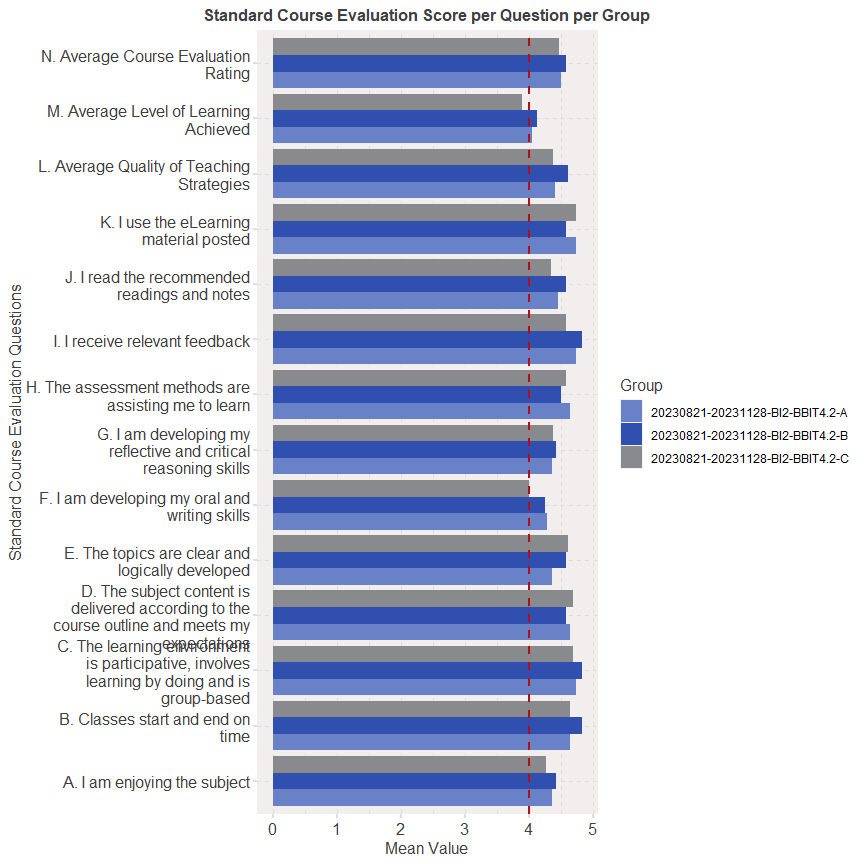<!-- -->

The **"Average Course Evaluation Rating"** variable in the plot below indicates the score **per gender** with a baseline of 4/5.

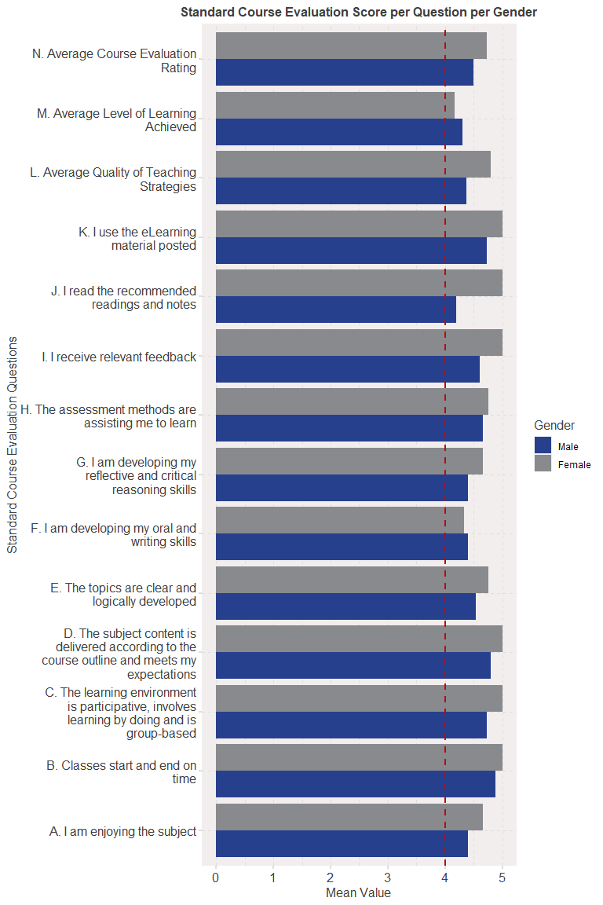<!-- -->

The plot below presents a drill-down of the class group into **regular and exempt** students:

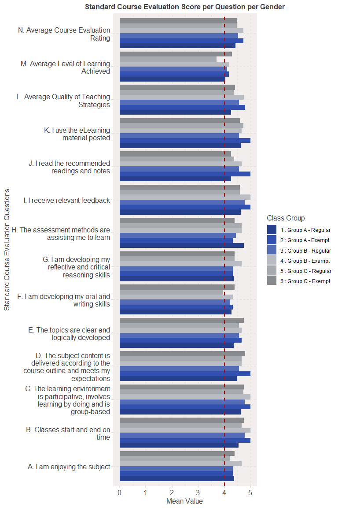<!-- -->

\newline

# Correlations

The following variables have been renamed to fit the correlation plots:

-   \`A. Enjoying Subject\` = \`Q02_General Questions-\>A - 1. I am enjoying the subject\`,

-   \`B. Classes Start-End\` = \`Q02_General Questions-\>A - 2. Classes start and end on time\`,

-   \`C. Learning Environment\` = \`Q02_General Questions-\>A - 3. The learning environment is participative, involves learning by doing and is group-based\`,

-   \`D. Content Delivery\` = \`Q02_General Questions-\>A - 4. The subject content is delivered according to the course outline and meets my expectations\`,

-   \`E. Clear Topics\` = \`Q02_General Questions-\>A - 5. The topics are clear and logically developed\`,

-   \`F. Oral and Writing\` = \`Q02_General Questions-\>A - 6. I am developing my oral and writing skills\`,

-   \`G. Critical Thinking\` = \`Q02_General Questions-\>A - 7. I am developing my reflective and critical reasoning skills\`,

-   \`H. Assessment Methods\` = \`Q02_General Questions-\>A - 8. The assessment methods are assisting me to learn\`,

-   \`I. Relevant Feedback\` = \`Q02_General Questions-\>A - 9. I receive relevant feedback\`,

-   \`J. Read Recommendations\` = \`Q02_General Questions-\>A - 10. I read the recommended readings and notes\`,

-   \`L. eLearning Material\` = \`Q02_General Questions-\>A - 11. I use the eLearning material posted\`,

-   \`Understood Concept 1\` = \`Q03_Level of Learning Achieved-\>B - 1. Concept 1 of 4 - Ensemble Methods for Predictive Analytics\`,

-   \`Understood Concept 2\` = \`Q03_Level of Learning Achieved-\>B - 2. Concept 2 of 4 - Predictive Modelling Using R\`,

-   \`Teaching - Labs\` = \`Q04_Quality of Teaching Strategies-\>C - 1. Labs with comments that describe each step to be followed\`,

-   \`Labs with Submission\` = \`Q04_Quality of Teaching Strategies-\>C - 2. Labs that require you to put in effort to make a submission related to the content of the lab\`,

-   \`Git in Teams\` =\`Q04_Quality of Teaching Strategies-\>C - 3. Labs that require you to use Git to work in a team\`,

-   \`Solo Labs\` = \`Q04_Quality of Teaching Strategies-\>C - 4. Labs that require you to work alone\`,

-   \`Quality of Lectures\` = \`Q04_Quality of Teaching Strategies-\>C - 5. The quality of the lectures given (quality measured by the breadth (the full span of knowledge of a subject) and depth (the extent to which specific topics are focused upon, amplified, and explored) of learning - NOT quality measured by how fun/comical/lively the lectures are)\`,

-   \`Recordings of Classes\` = \`Q04_Quality of Teaching Strategies-\>C - 6. The recordings of online classes\`,

-   \`Online Classes\` = \`Q04_Quality of Teaching Strategies-\>C - 7. Online classes in general\`,

-   \`Physical Classes\` = \`Q04_Quality of Teaching Strategies-\>C - 8. Face-to-Face classes in general\`

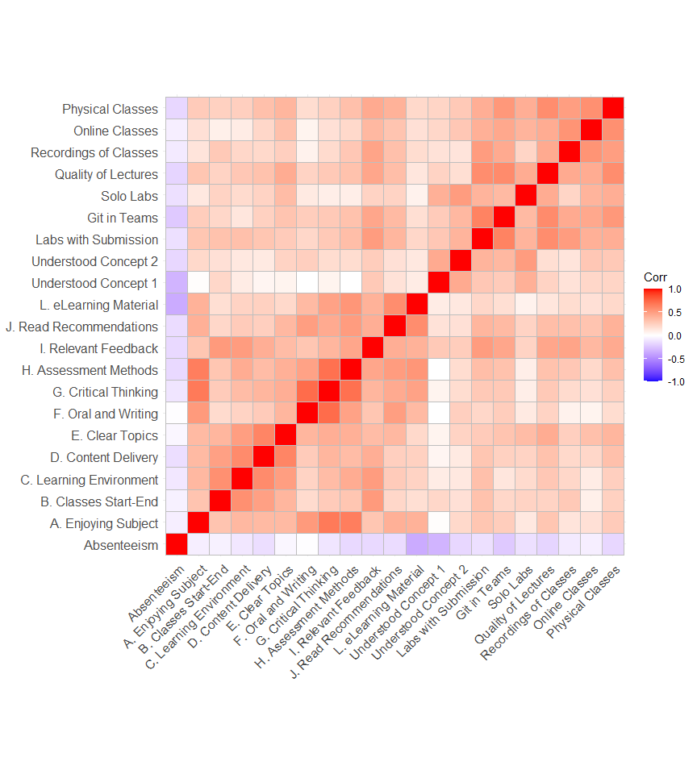<!-- -->

The specifc correlation values are presented below:

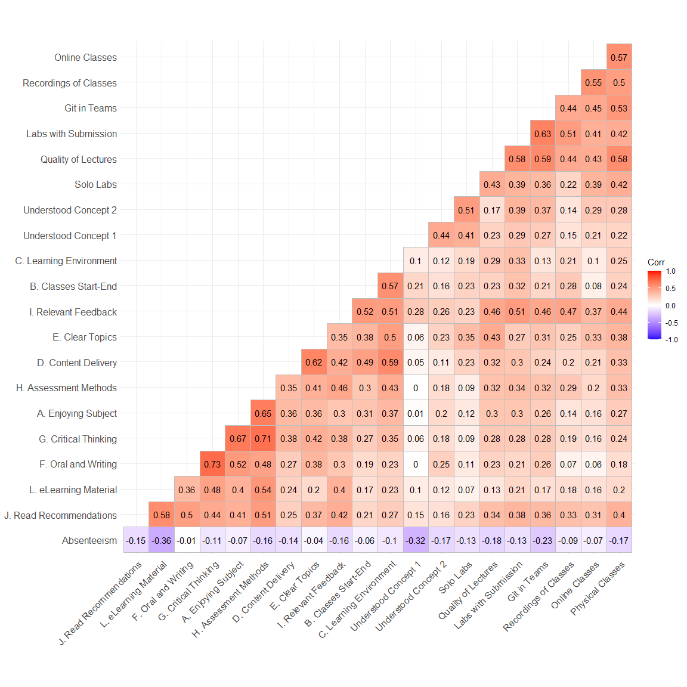<!-- -->

## Interesting Correlations

The following are hypothetical statements given that "correlation does not imply causation".

-   **.73 correlation** between "I am developing my oral and writing skills" and "I am developing my reflective and critical reasoning skills": *Consider writing as formalized thinking.*

-   **.71 correlation** between "The assessment methods are assisting me to learn" and "I am developing my reflective and critical reasoning skills": *The more effort students put into the assessment, the more they develop their reflective and critical reasoning skills.*

-   **.68 correlation** between "I am enjoying the subject" and "I am developing my reflective and critical reasoning skills": *The more a student enjoys the subject, the more they consider their reflective and critical reasoning skills as developing.*

-   **.65 correlation** between "The assessment methods are assisting me to learn" and "I am enjoying the subject": *Students who value the assessments enjoy the subject more.*

-   **.64 correlation** between "Labs that require you to use Git to work in a team" and "Labs that require you to put in effort to make a submission related to the content of the lab": *The more students appreciate the use of Git for working in teams, the more they appreciate labs that require a submission to be made.*

-   **.61 correlation** between "The subject content is delivered according to the course outline and meets my expectations" and "The topics are clear and logically developed": *The more the course outline is followed, the clearer and more logically developed the topics are.*

-   **-.33 correlation** between "Concept 1 of 4 - Ensemble Methods for Predictive Analytics" and "Absenteeism": *Students who started the semester late (high absenteeism), had a harder time understanding concept 1 which was covered at the beginning of the semester.*

-   **-.36 correlation** between "I use the e-learning material posted" and "absenteeism": *The higher the number of classes missed, the lower the student's engagement with content posted on e-learning*

Below are the two most extreme (positive and negative) correlations:

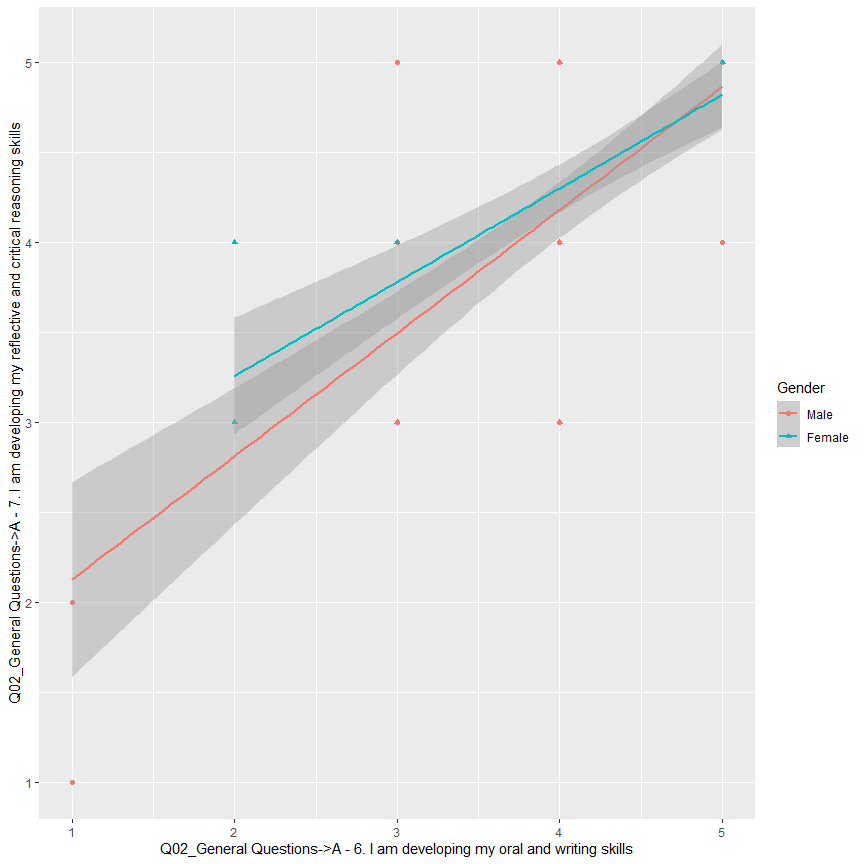<!-- -->

<!-- -->

# Qualitative Data (Likes and Wishes)

The most significant words used in the likes include:

The most significant words used in the wishes include:

The plot below presents the quantitative measure of "significance" using the Term Frequency - Inverse Document Frequency (TF-IDF) score:

TF-IDF Score Likes per Gender

<!-- -->

TF-IDF Score Likes per Class Group

<!-- -->

TF-IDF Score Wishes per Gender:

<!-- -->

TF-IDF Score Wishes per Group

<!-- -->

\newpage

## Lexicon-Based Sentiment Analysis

The overall sentiment for the likes:

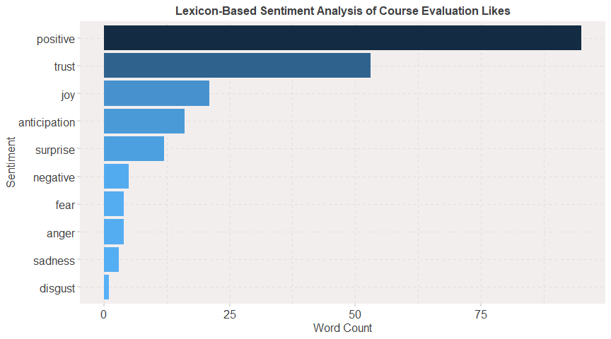<!-- -->

\newpage

The overall sentiment for the wishes:

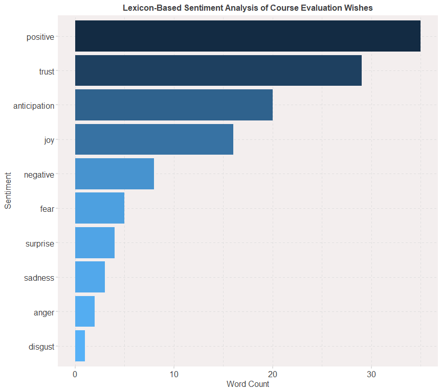<!-- -->

\newpage

Chord Diagram of Likes per Class Group:

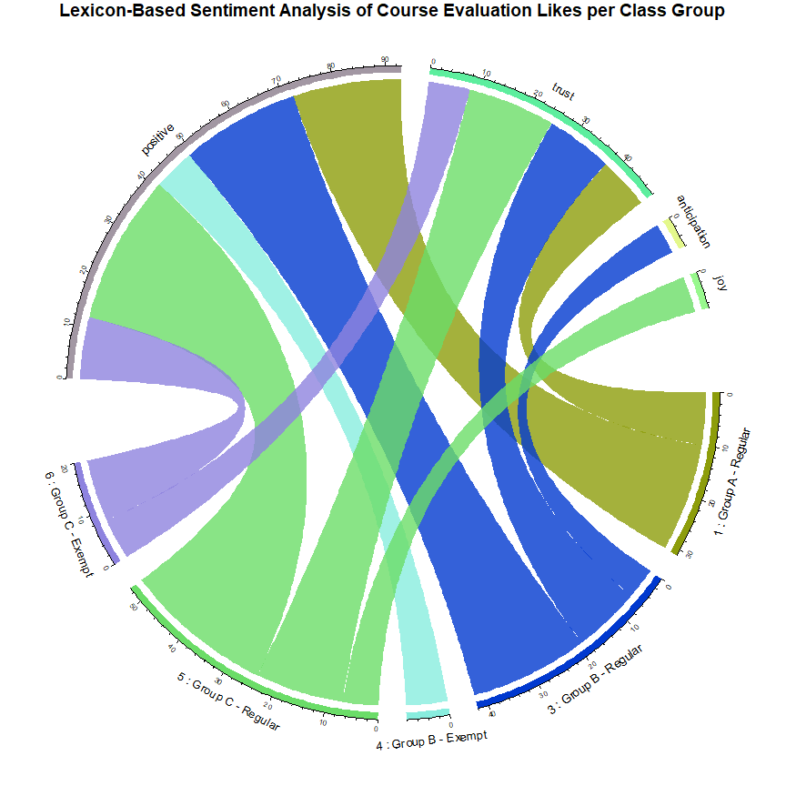<!-- -->

\newpage

Chord Diagram of Likes per Class Gender:

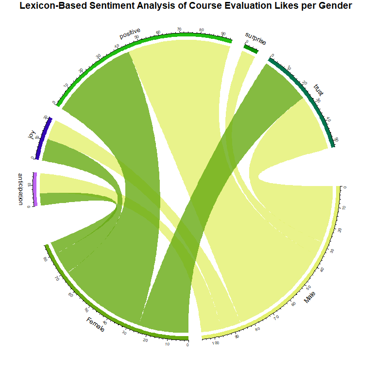<!-- -->

\newpage

Chord Diagram of Wishes per Class Group:

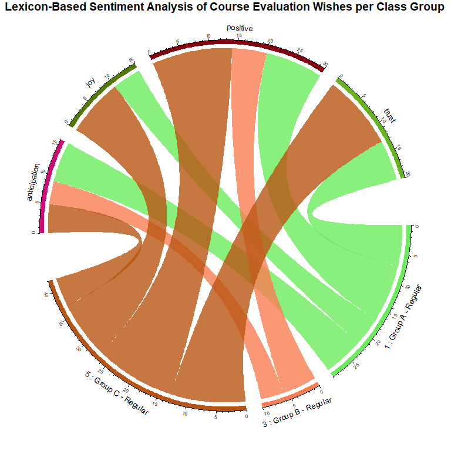<!-- -->

Chord Diagram of Wishes per Gender:

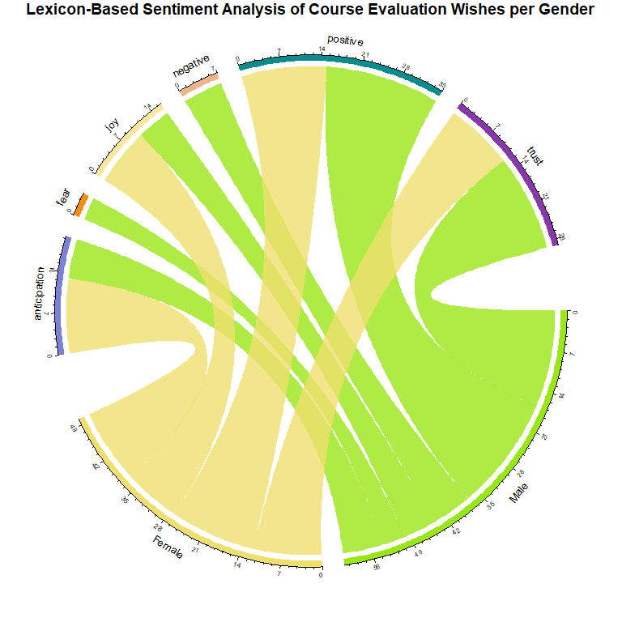<!-- -->

\newpage

## Raw Data

The raw data of the likes is as follows:

<table>
<caption>Write two things you like about the teaching and learning in this unit so far</caption>
 <thead>
  <tr>
   <th style="text-align:left;"> x </th>
  </tr>
 </thead>
<tbody>
  <tr>
   <td style="text-align:left;"> It is interesting and helps improve coding skills </td>
  </tr>
  <tr>
   <td style="text-align:left;"> it is very detailed hence of great helpIt is interactive both in the unit and in regards to other units such as IS project II </td>
  </tr>
  <tr>
   <td style="text-align:left;">  Ensemble Methods for Predictive Analytics   Predictive Modelling Using R  </td>
  </tr>
  <tr>
   <td style="text-align:left;"> Interactive </td>
  </tr>
  <tr>
   <td style="text-align:left;"> The concepts are well explained  Communication is effective  </td>
  </tr>
  <tr>
   <td style="text-align:left;"> It is a bit more practical due to the use of python and r  The instructor is well organized and the teaching methods are useful </td>
  </tr>
  <tr>
   <td style="text-align:left;"> It is practical and based on modern concepts  The labs are interesting and thought provoking </td>
  </tr>
  <tr>
   <td style="text-align:left;"> I like that the labs are practical  I like being given enough time to do the labs </td>
  </tr>
  <tr>
   <td style="text-align:left;"> Everything is good </td>
  </tr>
  <tr>
   <td style="text-align:left;"> It is interesting and interactive since we get to use different tools in our sessions. </td>
  </tr>
  <tr>
   <td style="text-align:left;"> So far its been a hard unit and fortunately the teaching style for the lecture is helping as he guides us along  </td>
  </tr>
  <tr>
   <td style="text-align:left;"> Lecturer is efficient  classes start and end on time </td>
  </tr>
  <tr>
   <td style="text-align:left;"> Increase submission deadline  </td>
  </tr>
  <tr>
   <td style="text-align:left;"> The practical labs are engaging hence skill development   the teaching method and lectures  </td>
  </tr>
  <tr>
   <td style="text-align:left;"> 1. It is comprehensive  2. It is interesting. </td>
  </tr>
  <tr>
   <td style="text-align:left;"> It is step by step    </td>
  </tr>
  <tr>
   <td style="text-align:left;"> - The content is really engaging and intense and shows that learning is there.  - Also additional hands on skills like using GitHub and collaborations which plays a huge role in the personal development goals in the digital space.  </td>
  </tr>
  <tr>
   <td style="text-align:left;"> N/A </td>
  </tr>
  <tr>
   <td style="text-align:left;"> Interactivity and applicability of the unit </td>
  </tr>
  <tr>
   <td style="text-align:left;"> The online classes  The Labs that require submissions help me to dig deeper. </td>
  </tr>
  <tr>
   <td style="text-align:left;"> The unit is very practical which helps me in the long run.  The lecturer does not leave anyone behind, ensures everyone has understood the concept </td>
  </tr>
  <tr>
   <td style="text-align:left;"> Work is clearly and easily broken down  The lecturer is very available for consultation </td>
  </tr>
  <tr>
   <td style="text-align:left;"> The teaching for this unit has been very comprehensive so far and engaging with the lecturer.  The learning implements group works. </td>
  </tr>
  <tr>
   <td style="text-align:left;"> Learning to use GIT  Being taught practically and through walk-throughs </td>
  </tr>
  <tr>
   <td style="text-align:left;"> The step by step explanation of the concepts is very helpful  The time to complete the labs is sufficient  </td>
  </tr>
  <tr>
   <td style="text-align:left;"> The lec takes his time to teach the concept </td>
  </tr>
  <tr>
   <td style="text-align:left;"> Detailed Explanations.  Quick feedback by lecturer. </td>
  </tr>
  <tr>
   <td style="text-align:left;"> The lecturer is readily available to help when one is stuck  The unit is well structured and organized </td>
  </tr>
  <tr>
   <td style="text-align:left;"> Very in depth  Very practical </td>
  </tr>
  <tr>
   <td style="text-align:left;"> Its practical and has interactive learning  </td>
  </tr>
  <tr>
   <td style="text-align:left;"> It is interactive   It is engaging </td>
  </tr>
  <tr>
   <td style="text-align:left;"> The lecturer does everything in his power to ensure we are comfortable with content being taught and make sure we are following along together. The e-learning site is also very well organized and categorized for this unit </td>
  </tr>
  <tr>
   <td style="text-align:left;"> Answers the questions asked  Explains well </td>
  </tr>
  <tr>
   <td style="text-align:left;"> Patience and flow </td>
  </tr>
  <tr>
   <td style="text-align:left;"> mode of delivery  Information </td>
  </tr>
  <tr>
   <td style="text-align:left;"> The mode of delivery   The assistance of reference links put on elearning for easy reference  </td>
  </tr>
  <tr>
   <td style="text-align:left;"> The lecturer ensures everyone understandsThe labs are fun </td>
  </tr>
  <tr>
   <td style="text-align:left;"> The lecturer ensures everyone has understood.  It is practical. </td>
  </tr>
  <tr>
   <td style="text-align:left;"> The explanations to the various concepts are well explained  </td>
  </tr>
  <tr>
   <td style="text-align:left;"> the labs sessions are nice </td>
  </tr>
  <tr>
   <td style="text-align:left;"> i like the group labs  i like the topics </td>
  </tr>
  <tr>
   <td style="text-align:left;"> I find it current industry oriented </td>
  </tr>
  <tr>
   <td style="text-align:left;"> The lecturer provides adequate feedback on the questions asked.  The lab work clearly elaborates on the work taught. </td>
  </tr>
  <tr>
   <td style="text-align:left;"> The lecturer explains the content really well. </td>
  </tr>
  <tr>
   <td style="text-align:left;"> Takes time to organize his work, I appreciate the effort </td>
  </tr>
  <tr>
   <td style="text-align:left;"> So far so good  The lecturer is very clear </td>
  </tr>
  <tr>
   <td style="text-align:left;"> It is comprehensive  It is easy to follow </td>
  </tr>
  <tr>
   <td style="text-align:left;"> Labs that describe each step to be followed are engaging and learning enables me to follow through the lab properly  It is very engaging and interactive. </td>
  </tr>
  <tr>
   <td style="text-align:left;"> The lecturer asks questions  The lectures are clear  </td>
  </tr>
  <tr>
   <td style="text-align:left;"> Interactive  Interesting  </td>
  </tr>
  <tr>
   <td style="text-align:left;"> The assistance by the lecturer, the practicality </td>
  </tr>
  <tr>
   <td style="text-align:left;"> Lab work  Class sessions </td>
  </tr>
  <tr>
   <td style="text-align:left;">  It is very participative and lecturer gives room for questions </td>
  </tr>
  <tr>
   <td style="text-align:left;"> feedback is quickLecturer is willing to help </td>
  </tr>
  <tr>
   <td style="text-align:left;"> Working as a team </td>
  </tr>
  <tr>
   <td style="text-align:left;"> the fact that we get to do the lab work in groups   the interactive online and on campus classes </td>
  </tr>
  <tr>
   <td style="text-align:left;"> I like how the Lecturer explains the concepts and takes us through the labs </td>
  </tr>
  <tr>
   <td style="text-align:left;"> The concept are explained very well  A chance to learn R I have wanting to interact with R and data </td>
  </tr>
  <tr>
   <td style="text-align:left;"> very interactive and hands on </td>
  </tr>
  <tr>
   <td style="text-align:left;"> on hand Practice  Good delivery </td>
  </tr>
  <tr>
   <td style="text-align:left;"> It’s interactive and very logical. </td>
  </tr>
  <tr>
   <td style="text-align:left;"> The technical aspect of the unit.  The attentiveness to detail when it comes to the labs and concepts are clearly explained. </td>
  </tr>
  <tr>
   <td style="text-align:left;"> Wide scope of content  Practicability </td>
  </tr>
  <tr>
   <td style="text-align:left;"> Once you follow the steps for the lab you will be okay.  The lecturer helps in one on one for the labs if one has an issue </td>
  </tr>
  <tr>
   <td style="text-align:left;"> I like the way the topics are broken down very logical and easy to understand.  I like that we are constantly able to ask questions and be answered regardless of the nature of the question. </td>
  </tr>
  <tr>
   <td style="text-align:left;"> The lectures </td>
  </tr>
  <tr>
   <td style="text-align:left;"> Its Good </td>
  </tr>
  <tr>
   <td style="text-align:left;"> the lecturer  the lectures </td>
  </tr>
  <tr>
   <td style="text-align:left;"> Lecturer, Teaching method </td>
  </tr>
  <tr>
   <td style="text-align:left;"> I like this ui=nit because it prompts me to think actually think and connect the dots  </td>
  </tr>
  <tr>
   <td style="text-align:left;"> Well explained content </td>
  </tr>
  <tr>
   <td style="text-align:left;"> Gaining R skills </td>
  </tr>
  <tr>
   <td style="text-align:left;"> Use of realistic  code  group work </td>
  </tr>
  <tr>
   <td style="text-align:left;"> practicality  Engagement </td>
  </tr>
  <tr>
   <td style="text-align:left;"> Group Labs </td>
  </tr>
  <tr>
   <td style="text-align:left;"> its straight forward and simple to understand  </td>
  </tr>
  <tr>
   <td style="text-align:left;"> I like the practicality of R and learning github in depth through the group work </td>
  </tr>
  <tr>
   <td style="text-align:left;"> Group workPractical Exercises </td>
  </tr>
  <tr>
   <td style="text-align:left;"> The learning of this unit is good in terms of the detailed and step by step practicals shown by the lecturer for each lab.The recordings. </td>
  </tr>
  <tr>
   <td style="text-align:left;"> I like that it challenges me to apply everything practically. </td>
  </tr>
  <tr>
   <td style="text-align:left;"> None </td>
  </tr>
  <tr>
   <td style="text-align:left;"> The practical aspect.  The group work is good. </td>
  </tr>
  <tr>
   <td style="text-align:left;"> Labs activities, Quizzes help a lot on learning during the semester </td>
  </tr>
  <tr>
   <td style="text-align:left;"> clear and direct to the point   step by step teaching works for me </td>
  </tr>
  <tr>
   <td style="text-align:left;"> The lecturer explains everything in detail and caters for both ides that is vscode and rstudio </td>
  </tr>
  <tr>
   <td style="text-align:left;"> N/A </td>
  </tr>
  <tr>
   <td style="text-align:left;"> N/A  </td>
  </tr>
  <tr>
   <td style="text-align:left;"> How to use and implement R as a language for data analysis </td>
  </tr>
  <tr>
   <td style="text-align:left;"> I am learning to use new language, R language, and how to use it together with the available libraries for predictive analytics.    </td>
  </tr>
  <tr>
   <td style="text-align:left;"> Its practical  </td>
  </tr>
  <tr>
   <td style="text-align:left;"> It is very practical and a good example of a prospective career path for many. </td>
  </tr>
  <tr>
   <td style="text-align:left;"> 1. The lecturer makes the content easy to understand </td>
  </tr>
  <tr>
   <td style="text-align:left;"> the teaching method  the recording being online is also helpful  </td>
  </tr>
  <tr>
   <td style="text-align:left;"> The practicals </td>
  </tr>
</tbody>
</table>

The raw data of the wishes is as follows:

<table>
<caption>Write at least one recommendation to improve the teaching and learning in this unit (for the remaining weeks in the semester)</caption>
 <thead>
  <tr>
   <th style="text-align:left;"> x </th>
  </tr>
 </thead>
<tbody>
  <tr>
   <td style="text-align:left;"> none </td>
  </tr>
  <tr>
   <td style="text-align:left;"> i would like if the concepts were divided where we learn the functions first online then do the practicals of it in person </td>
  </tr>
  <tr>
   <td style="text-align:left;"> N/A </td>
  </tr>
  <tr>
   <td style="text-align:left;"> Flexibility </td>
  </tr>
  <tr>
   <td style="text-align:left;"> I don't have any  </td>
  </tr>
  <tr>
   <td style="text-align:left;"> Leniency with regards to lab work submission and future project work </td>
  </tr>
  <tr>
   <td style="text-align:left;"> More tutorials based on the labs </td>
  </tr>
  <tr>
   <td style="text-align:left;"> Use of less complex datasets </td>
  </tr>
  <tr>
   <td style="text-align:left;"> i have no recommendations </td>
  </tr>
  <tr>
   <td style="text-align:left;"> A guide to help us counter different problems like installation of packages during labs. </td>
  </tr>
  <tr>
   <td style="text-align:left;"> I would like lab exercises to be done more in class so as to easily understand  </td>
  </tr>
  <tr>
   <td style="text-align:left;"> Lecturer might be a bit fast at times </td>
  </tr>
  <tr>
   <td style="text-align:left;"> Step by step materials/videos on how to do the lab works  </td>
  </tr>
  <tr>
   <td style="text-align:left;"> student involvement   </td>
  </tr>
  <tr>
   <td style="text-align:left;"> 1. Nothing </td>
  </tr>
  <tr>
   <td style="text-align:left;"> Go easy on us abit, it is te last semester </td>
  </tr>
  <tr>
   <td style="text-align:left;"> - To give us insights or recommendations about certifications that we can as well do, related to this unit which will boost our C.Vs for the interested students.  </td>
  </tr>
  <tr>
   <td style="text-align:left;"> N/A </td>
  </tr>
  <tr>
   <td style="text-align:left;"> A bit more tutorials on technical errors such as ones on knitting and rendering the markdown files </td>
  </tr>
  <tr>
   <td style="text-align:left;"> If the concept requires many practicals, the classes should be more online. </td>
  </tr>
  <tr>
   <td style="text-align:left;"> For the physical class to be moved to a lab </td>
  </tr>
  <tr>
   <td style="text-align:left;"> Being more lenient with lab work </td>
  </tr>
  <tr>
   <td style="text-align:left;"> Everything is okay so far. </td>
  </tr>
  <tr>
   <td style="text-align:left;"> Sticking to a specific application to be used </td>
  </tr>
  <tr>
   <td style="text-align:left;"> No recommendation at the moment </td>
  </tr>
  <tr>
   <td style="text-align:left;"> None </td>
  </tr>
  <tr>
   <td style="text-align:left;"> The content is too broad and covers a lot i.e new softwares which make the unit overwhelming. </td>
  </tr>
  <tr>
   <td style="text-align:left;"> It would be better if the physical classes were being recorded because at times one might be behind or missed an important lab step    </td>
  </tr>
  <tr>
   <td style="text-align:left;"> No recommendations </td>
  </tr>
  <tr>
   <td style="text-align:left;"> N/A </td>
  </tr>
  <tr>
   <td style="text-align:left;"> Make the course work less bulky and complex </td>
  </tr>
  <tr>
   <td style="text-align:left;"> no comment </td>
  </tr>
  <tr>
   <td style="text-align:left;"> n/a </td>
  </tr>
  <tr>
   <td style="text-align:left;"> Too much content to deal with </td>
  </tr>
  <tr>
   <td style="text-align:left;"> time liniency </td>
  </tr>
  <tr>
   <td style="text-align:left;"> That the labs should be given more time to them  </td>
  </tr>
  <tr>
   <td style="text-align:left;"> Breaks in between classes </td>
  </tr>
  <tr>
   <td style="text-align:left;"> Nothing. I am enjoying and understanding the course. </td>
  </tr>
  <tr>
   <td style="text-align:left;"> None  </td>
  </tr>
  <tr>
   <td style="text-align:left;"> increase more labs </td>
  </tr>
  <tr>
   <td style="text-align:left;"> the labs are quite hefty so it really makes the work easier to do in a group </td>
  </tr>
  <tr>
   <td style="text-align:left;"> More engagement </td>
  </tr>
  <tr>
   <td style="text-align:left;"> More time to be allocated in the lab work assignments. </td>
  </tr>
  <tr>
   <td style="text-align:left;"> Nothing </td>
  </tr>
  <tr>
   <td style="text-align:left;"> I am content </td>
  </tr>
  <tr>
   <td style="text-align:left;"> Reduce content  Reduce labwork </td>
  </tr>
  <tr>
   <td style="text-align:left;"> . </td>
  </tr>
  <tr>
   <td style="text-align:left;"> Proper detailed explanation of the labs, rather than rushing through them quickly   More time is needed for lab completion and progressive follow-up so the lecturer knows where you are stuck. </td>
  </tr>
  <tr>
   <td style="text-align:left;"> More time for labs </td>
  </tr>
  <tr>
   <td style="text-align:left;"> So far none </td>
  </tr>
  <tr>
   <td style="text-align:left;"> Reduce the workload, its honestly too much </td>
  </tr>
  <tr>
   <td style="text-align:left;"> More reference material  Breaks during classes at least 5 mins    </td>
  </tr>
  <tr>
   <td style="text-align:left;"> None....The unit met my expectation and was delivered perfectly </td>
  </tr>
  <tr>
   <td style="text-align:left;"> Avoid online classes </td>
  </tr>
  <tr>
   <td style="text-align:left;"> Deadlines to be extended abit </td>
  </tr>
  <tr>
   <td style="text-align:left;"> N/A </td>
  </tr>
  <tr>
   <td style="text-align:left;"> i am enjoying the unit as it is </td>
  </tr>
  <tr>
   <td style="text-align:left;"> Since we are about to finish our 8.4.4 system. To give us more recommendation on certificates and what the job market expects from us </td>
  </tr>
  <tr>
   <td style="text-align:left;"> better communication of activities btwn the students and the lec  </td>
  </tr>
  <tr>
   <td style="text-align:left;"> . </td>
  </tr>
  <tr>
   <td style="text-align:left;"> Ensure that the code work can work with any dataset and not fixated on provided dataset </td>
  </tr>
  <tr>
   <td style="text-align:left;"> I would like there be more simpler labs with easier datasets to understands the concepts first then move on to more complex data handling and manipulation. </td>
  </tr>
  <tr>
   <td style="text-align:left;"> None so far </td>
  </tr>
  <tr>
   <td style="text-align:left;"> Kindly share more reading materials and past papers. </td>
  </tr>
  <tr>
   <td style="text-align:left;"> I recommend that the deadlines on the labs be more flexible as there are many subject and projects running concurrently. </td>
  </tr>
  <tr>
   <td style="text-align:left;"> The labs are long, they are individually basically the same size as an entire same project </td>
  </tr>
  <tr>
   <td style="text-align:left;"> No recomendation </td>
  </tr>
  <tr>
   <td style="text-align:left;"> so far so good </td>
  </tr>
  <tr>
   <td style="text-align:left;"> Greater in depth exploration into labs to ensure we're actually understanding what is going on. </td>
  </tr>
  <tr>
   <td style="text-align:left;"> The content is so hard to understand and the lec solving other people's issues only bring more confusion to some of us, I wish he would go through the content first then afterwards focus on individual problems </td>
  </tr>
  <tr>
   <td style="text-align:left;"> He is doing a good job </td>
  </tr>
  <tr>
   <td style="text-align:left;"> Personally I use linux and its kinda hard for me   You can add some YouTube materials  </td>
  </tr>
  <tr>
   <td style="text-align:left;"> Lab submissions still very confusing </td>
  </tr>
  <tr>
   <td style="text-align:left;"> More online sessions </td>
  </tr>
  <tr>
   <td style="text-align:left;"> None </td>
  </tr>
  <tr>
   <td style="text-align:left;"> so far so good </td>
  </tr>
  <tr>
   <td style="text-align:left;"> Adequate time for completing the labs </td>
  </tr>
  <tr>
   <td style="text-align:left;"> More group work, less individual work </td>
  </tr>
  <tr>
   <td style="text-align:left;">  No recommendations there is good delivery. </td>
  </tr>
  <tr>
   <td style="text-align:left;"> One recommendation may be to explain how these concepts can relate to and apply to our IS Project 2. </td>
  </tr>
  <tr>
   <td style="text-align:left;"> None </td>
  </tr>
  <tr>
   <td style="text-align:left;"> It is okay. </td>
  </tr>
  <tr>
   <td style="text-align:left;"> - Slide are very long (too much content) lecture can improve on that- </td>
  </tr>
  <tr>
   <td style="text-align:left;"> nothing really </td>
  </tr>
  <tr>
   <td style="text-align:left;"> There are many labs </td>
  </tr>
  <tr>
   <td style="text-align:left;"> N/A </td>
  </tr>
  <tr>
   <td style="text-align:left;"> N/A </td>
  </tr>
  <tr>
   <td style="text-align:left;"> No comment, everything is fine </td>
  </tr>
  <tr>
   <td style="text-align:left;"> None </td>
  </tr>
  <tr>
   <td style="text-align:left;"> nothing all is well </td>
  </tr>
  <tr>
   <td style="text-align:left;"> n/a. </td>
  </tr>
  <tr>
   <td style="text-align:left;"> N/A </td>
  </tr>
  <tr>
   <td style="text-align:left;"> so far I have been struggling a little with the Lab a bit but i'm hoping it will get better as we continue with the other labs </td>
  </tr>
  <tr>
   <td style="text-align:left;"> N/A </td>
  </tr>
</tbody>
</table>
